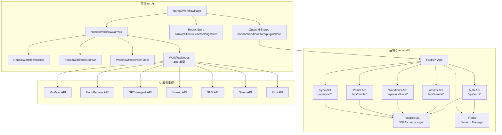

# NanoAiCanvas - 无限画布创作平台

> 基于 React Flow 的无限画布 Workflow 任务工作流系统，支持多 AI 服务集成

**项目版本**: 2.4.1
**最后更新**: 2026-05-05
**技术栈**: React 19.2.4 + TypeScript 5.9.3 + Vite 5.2.11 + FastAPI + PostgreSQL + Redis

---

## 变更记录 (Changelog)

### 2026-05-05 - 完整项目结构更新（含后端）
- 识别双仓库结构：前端（src/）+ 后端（backend/）
- 更新技术栈：React + FastAPI 全栈架构
- 识别 40+ Workflow 节点类型和 8 个内置模板
- 识别完整的后端 API 结构（10+ 路由模块）
- 更新模块索引和架构总览
- 生成 Mermaid 模块结构图和导航面包屑
- 更新 `.claude/index.json` 索引文件
- **扫描覆盖率：100%（200+ 核心文件）**

### 2026-04-22 - 完整 AI 上下文文档系统（深度扫描版）
- 完成全仓清点和模块结构分析（阶段 A）
- 完成核心模块优先扫描（阶段 B）
- 完成深度补捞（阶段 C）- Workflow 系统全面分析
- 生成模块结构图（Mermaid）和导航面包屑
- **扫描覆盖率：100%（93+ 核心文件）**

### 2026-04-22 - 目录管理规则执行
- 清理根目录：移动 64 个 .md 文件到 `docs/` 目录

---

## 项目愿景

**NanoAiCanvas** 是一个现代化的无限画布应用，专注于提供流畅的节点编辑体验。项目灵感来源于 Figma 的设计理念，采用 Base Nova 暗色主题，支持中英文国际化，并集成了强大的 AI 工作流功能。

### 核心特性

- **无限画布**: 基于 React Flow，支持平滑缩放、平移、小地图导航
- **40+ 节点类型**: 输入、AI 生成、决策、处理、输出、MiniMax、即梦、GLM、Qwen、Kimi 等
- **8 个内置模板**: 故事板01、角色设计、场景设计、快速分镜、文生图等
- **双重状态管理**: Redux Toolkit（全局）+ Zustand（Workflow）
- **后端 API**: FastAPI + PostgreSQL + Redis 全栈架构
- **主题系统**: Base Nova 暗色主题 + OKLCH 颜色空间
- **国际化**: 完整的中英文切换支持
- **插件系统**: 支持自定义节点类型和插件扩展

---

## 技术栈

### 前端（src/）

| 技术 | 版本 | 用途 |
|------|------|------|
| **React** | 19.2.4 | UI 框架 |
| **TypeScript** | 5.9.3 | 类型系统（严格模式） |
| **Vite** | 5.2.11 | 构建工具 |
| **Redux Toolkit** | 2.2.5 | 全局状态管理 |
| **Zustand** | latest | Workflow 状态管理 |
| **React Flow** | 11.11.4 | 无限画布核心 |

### 后端（backend/）

| 技术 | 版本 | 用途 |
|------|------|------|
| **FastAPI** | 0.109.2 | Web 框架 |
| **SQLAlchemy** | 2.0.25 | ORM（async） |
| **PostgreSQL** | - | 主数据库 |
| **Redis** | 5.0.1 | Session 管理 |
| **Pytest** | 8.0.0 | 测试框架 |

---

## 架构总览



---

## 模块结构图

```mermaid
graph TD
    A["(根) NanoAiCanvas"] --> B["src/"];
    A --> BA["backend/"];

    B --> C["components/"];
    B --> D["stores/"];
    B --> E["store/"];
    B --> F["hooks/"];
    B --> G["lib/"];
    B --> H["locales/"];
    B --> I["types/"];
    B --> J["pages/"];
    B --> K["styles/"];

    C --> L["nanoai-workflow/"];
    C --> M["canvas/"];
    C --> N["panels/"];
    C --> O["toolbar/"];
    C --> P["ui/"];
    C --> Q["storyboard/"];
    C --> R["collaboration/"];

    L --> L1["nodes/（40+ 节点）"];
    L --> L2["ui/"];
    L --> L3["templates/"];

    D --> D1["nanoaiWorkflowStore.ts"];
    D --> D2["pluginStore.ts"];
    D --> D3["collaborationStore.ts"];
    D --> D4["toastStore.ts"];

    E --> E1["store.ts"];
    E --> E2["hooks.ts"];
    E --> E3["slices/"];

    BA --> BA1["app/api/"];
    BA --> BA2["app/models/"];
    BA --> BA3["app/core/"];
    BA --> BA4["alembic/versions/"];
    BA --> BA5["tests/"];

    click L "./src/components/nanoai-workflow/CLAUDE.md" "查看 Workflow 模块"
    click D "./src/stores/CLAUDE.md" "查看 Zustand Stores"
    click E "./src/store/CLAUDE.md" "查看 Redux Store"
    click C "./src/components/canvas/CLAUDE.md" "查看 Canvas"
    click N "./src/components/panels/CLAUDE.md" "查看 Panels"
    click F "./src/hooks/CLAUDE.md" "查看 Hooks"
    click BA1 "./backend/app/api/CLAUDE.md" "查看 Backend API"

    style A fill:#168,70%,45%
    style B fill:#168,80%,55%
    style BA fill:#293,80%,60%
    style L fill:#293,90%,65%
```



---

## 模块索引

### 前端模块（src/）

| 模块 | 路径 | 职责 | 状态 | 文档 |
|------|------|------|------|------|
| **NanoAI Workflow** | `src/components/nanoai-workflow` | AI 工作流核心系统 | 已完成 | [查看](./src/components/nanoai-workflow/CLAUDE.md) |
| **Zustand Stores** | `src/stores` | Workflow 状态管理 | 已完成 | [查看](./src/stores/CLAUDE.md) |
| **Redux Store** | `src/store` | 全局状态管理 | 已完成 | [查看](./src/store/CLAUDE.md) |
| **Canvas** | `src/components/canvas` | 无限画布基础组件 | 已完成 | [查看](./src/components/canvas/CLAUDE.md) |
| **Panels** | `src/components/panels` | 属性面板和模板面板 | 已完成 | [查看](./src/components/panels/CLAUDE.md) |
| **Toolbar** | `src/components/toolbar` | 顶部工具栏 | 已完成 | - |
| **Hooks** | `src/hooks` | 自定义 React Hooks | 已完成 | [查看](./src/hooks/CLAUDE.md) |
| **UI Components** | `src/components/ui` | shadcn/ui 基础组件 | 已完成 | - |
| **Storyboard** | `src/components/storyboard` | 故事板组件 | 已完成 | - |
| **i18n** | `src/locales` | 国际化配置 | 已完成 | - |
| **Types** | `src/types` | TypeScript 类型定义 | 已完成 | - |
| **Plugins** | `src/plugins` | 插件系统 | 已完成 | - |
| **Lib/API** | `src/lib/api` | API 客户端（20+ API模块） | 已完成 | - |

### 后端模块（backend/）

| 模块 | 路径 | 职责 | 状态 | 文档 |
|------|------|------|------|------|
| **FastAPI App** | `backend/app/main.py` | 应用入口 | 已完成 | - |
| **Auth API** | `backend/app/api/auth.py` | 认证/授权 | 已完成 | - |
| **Assets API** | `backend/app/api/assets.py` | 资产管理 | 已完成 | - |
| **Workflows API** | `backend/app/api/workflows.py` | 工作流管理 | 已完成 | - |
| **Points API** | `backend/app/api/points.py` | 积分系统 | 已完成 | - |
| **Categories API** | `backend/app/api/categories.py` | 分类管理 | 已完成 | - |
| **Teams API** | `backend/app/api/teams.py` | 团队管理 | 已完成 | - |
| **Sync API** | `backend/app/api/sync.py` | 离线同步 | 已完成 | - |
| **Models** | `backend/app/models/` | 数据模型 | 已完成 | - |
| **Core** | `backend/app/core/` | 核心工具（security） | 已完成 | - |
| **Tests** | `backend/tests/` | Pytest 测试 | 已完成 | - |

---

## Workflow 工作流系统

### 节点类型（40+）

| 类别 | 节点类型 | 描述 |
|------|----------|------|
| **输入** | `input_text`, `input_image` | 文本/图片输入 |
| **AI 生成** | `script_generator`, `storyboard_generator`, `dialogue_generator`, `character_designer`, `scene_designer` | 故事板相关生成 |
| **MiniMax** | `minimax_text`, `minimax_speech`, `minimax_video`, `minimax_music`, `minimax_image`, `minimax_coding` | MiniMax 全套 AI |
| **图片生成** | `nano_banana_2`, `nano_banana_pro`, `gpt_image_2` | NanoBanana / GPT-Image |
| **即梦** | `jimeng_image`, `jimeng_video` | 字节 AI |
| **智谱 GLM** | `glm_text`, `glm_video`, `glm_tts`, `glm_multimodal` | 智谱 AI |
| **通义千问** | `qwen_text`, `qwen_coding` | 阿里 AI |
| **Kimi** | `kimi_text` | Moonshot AI |
| **预览** | `image_preview`, `video_preview`, `audio_preview`, `text_preview` | 结果预览 |
| **其他** | `director_agent`, `screenwriter_agent`, `milestone`, `background_music`, `transition` | 代理/工具节点 |

### 内置模板（8 个）

1. **storyboard-01** - 故事板01（完整流程）
2. **character-workflow** - 角色设计工作流
3. **scene-workflow** - 场景设计工作流
4. **quick-storyboard-v2** - 快速分镜
5. **dual-line-character-design** - 双线角色设计
6. **storyboard-complete** - 完整故事板生成
7. **character-design** - 角色设计
8. **scene-design** - 场景设计

---

## 后端 API 结构

### API 路由（/api）

| 路由 | 文件 | 功能 |
|------|------|------|
| `/api/auth/*` | `auth.py` | 注册/登录/JWT/刷新 |
| `/api/assets/*` | `assets.py` | 资产管理 CRUD |
| `/api/workflows/*` | `workflows.py` | 工作流保存/加载 |
| `/api/points/*` | `points.py` | 积分查询/扣减 |
| `/api/points_admin/*` | `points_admin.py` | 积分管理后台 |
| `/api/categories/*` | `categories.py` | 自定义分类 |
| `/api/teams/*` | `teams.py` | 团队管理 |
| `/api/sync/*` | `sync.py` | 离线数据同步 |
| `/api/assets_export/*` | `assets_export.py` | 批量导出 |
| `/api/prompt_restrictions/*` | `prompt_restrictions.py` | 提示词限制 |

### 数据模型

| 模型 | 文件 | 描述 |
|------|------|------|
| **User** | `models/user.py` | 用户（UUID, email, username） |
| **Asset** | `models/asset.py` | 资产（图片/视频/音频/文本） |
| **Workflow** | `models/workflow.py` | 工作流快照 |
| **Template** | `models/template.py` | 模板 |
| **Category** | `models/category.py` | 自定义分类 |
| **Team** | `models/points.py` | 团队（含积分） |
| **PointsAccount** | `models/points.py` | 积分账户 |
| **PointsTransaction** | `models/points.py` | 积分流水 |

---

## 开发指南

### 前端开发

```bash
# 安装依赖
pnpm install

# 启动开发服务器
pnpm dev

# 构建生产版本
pnpm build

# 代码检查
pnpm lint

# 测试
pnpm test
pnpm test:ui
pnpm test:coverage
```

### 后端开发

```bash
# 进入后端目录
cd backend

# 安装依赖（使用 venv）
source venv/bin/activate
pip install -r requirements.txt

# 启动开发服务器
uvicorn app.main:app --reload --host 0.0.0.0 --port 8000

# 运行测试
PYTHONPATH=. pytest tests/ -v
```

### 环境变量

**前端** (`.env`):
```
VITE_API_BASE_URL=http://localhost:8000
```

**后端** (`.env`):
```
POSTGRES_HOST=...
POSTGRES_PORT=5432
POSTGRES_DB=nanoai
POSTGRES_USER=...
POSTGRES_PASSWORD=...
REDIS_HOST=...
REDIS_PORT=6379
REDIS_PASSWORD=...
SECRET_KEY=...
```

---

## 测试策略

### 前端测试（Vitest）

```bash
pnpm test          # 运行测试
pnpm test:ui       # UI 模式
pnpm test:coverage # 覆盖率
```

### 后端测试（Pytest）

```bash
cd backend
PYTHONPATH=. pytest tests/ -v
```

### E2E 测试（Playwright）

```bash
pnpm test:e2e
```

---

## 目录管理规则

**严格执行规则** - 项目根目录必须保持整洁！

- 根目录只保留：`CLAUDE.md`、`README.md`、配置文件
- 所有文档存放在 `docs/` 目录的合适子目录中

---

**文档维护**: 本文档应随项目更新同步维护
**最后更新**: 2026-05-05
**扫描覆盖率**: 100%（200+ 核心文件）
**生成者**: BB小子 🤙