# NanoAiCanvas - 无限画布创作平台

> 基于 React Flow 的无限画布 Workflow 任务工作流系统，支持多 AI 服务集成

**项目版本**: 2.13.1
**最后更新**: 2026-05-20
**技术栈**: React 19.2.4 + TypeScript 5.9.3 + Vite 5.2.11 + FastAPI + PostgreSQL + Redis
**Agent 系统**: Nanoai Team8 V0.3.0（自进化短剧创作 Agent Team）

---

## 变更记录 (Changelog)

### 2026-05-20 - Nanoai Team8 Agent System V0.3.0（自进化短剧创作 Agent Team）
- 新增 9 角色化 Agent Team：Producer / Screenwriter / Director / ArtDirector / CharacterDesigner / SceneDesigner / VoiceDirector / Editor / Composer
- 新增 4 层记忆栈（L0 Identity → L1 Essential → L2 On-Demand → L3 Deep Search），Stability 半衰期评分 + 自动修剪
- 新增 6 阶段睡眠模式：review_memories → prune → skill_review → efficiency_optimization → validation → report
- 新增 Git 式用户分支技能系统：fork/diff/pull/push/merge
- 新增 Gateway 网关模式：Redis BRPOP 任务队列 + REST API + WebSocket + MCP stdio 桥接
- 新增双模型路由：Cloud（GLM API）+ Local（oMLX localhost:11434）
- 新增 8 阶段改编管线：prepare → statistics → outline → plan → script → quality_control → merge → archive
- 新增效率自优化引擎（EfficiencyOptimizer）：瓶颈分析 + 失败模式检测 + 自动优化建议
- 新增 7 张数据表 + Alembic 迁移 `015_agent_system.py`：agent_sessions / agent_memories / agent_tasks / agent_execution_logs / system_skills / user_skills / skill_promotion_requests
- 新增 V2 Agent API（`agent.py`）：17 路由含 WebSocket 双向通信 + Skills CRUD
- 新增 MCP Bridge（stdio → Redis Pub/Sub）：5 Tools 对接 Claude Code / Cursor
- 新增前端 AboutDialog + agent-api.ts 客户端
- 后端 Agent 模块共 36 文件 / 3573 行（含 prompts + 配置）
- 独立版本号 V0.3.0，版权 AiHXC.Team

### 2026-05-18 - TVC双参考图重构 + 资产自动保存 + Seedance升级（v2.12.350）
- TVC 双参考图工作流重构：生图从 2N 降到 2（ShotRefImage + CharacterDesignImage → 单轮双图）
- Seedance 视频升级 2.0：模型 doubao-seedance-2-0-260128，支持 resolution(480p/720p/1080p) + duration 参数
- Seedance 隐私拦截自动去尾帧首帧重试机制
- TVC 资产自动保存：生成的图片/视频自动关联资产库
- 移除 MiniMax/CogVideoX-3 视频提供者，Seedance 为唯一视频提供者
- 简化视频生成逻辑，移除冗余 fallback/provider 抽象
- 后端新增 `video_thumbnail.py` 视频关键帧缩略图服务（FFmpeg 提取）
- 前端新增 `video-editor-api.ts` 视频编辑 API 客户端
- 团队积分优先扣减机制：先团队后个人，不足时需确认
- 后端新增 `seedance_constants.py` Seedance 常量配置
- API 客户端从 40+ 增长到 43+

### 2026-05-18 - 视频合成 CLI + AI 剪辑 Chat（v2.12.313）
- 新增 cli-agent/ 独立子包（18 文件，1281 行）
- FFmpeg 7 操作封装：concat/amix/overlay/subtitles/normalize/compare/extractAudio
- 4 阶段管线编排：拼接→对比→字幕→混音+多规格（1080p+4K）
- CLI 5 命令：compose/concat/compare/subtitle/bgm + mcp + serve
- MCP Server（stdio）：4 Tools（compose/concat/compare/status）
- Fastify HTTP API：compose/tasks/health
- VideoComposeSkill 标准接口（可对接不同 Agent）
- 前端 VideoChatPanel 可复用对话组件（244 行）
- 前端 StoryboardVideoPanel Tab 面板集成到 TVC 第3节点属性面板
- 后端 glm_proxy 新增 `POST /tvc-video-agent` + `POST /tvc-video-agent/stream`（SSE）
- Agent 使用 glm-4.5-air 解析用户意图返回结构化 JSON 指令
- WorkflowPropertiesPanel 从 1256→1199 行（内联替换为组件引用）
- cli-agent 测试 9 + 前端测试 23 = 32 全通过，Vite 构建通过

### 2026-05-17 - TVC项目管理 + 模型检测 + 资产库升级（v2.12.312）
- 新增 TVC 项目数据模型（`TvcProject` + `TvcProjectShot`）：项目级组织，关联文案→剧本→镜头→成片
- 新增 TVC 项目管理 API（`tvc_projects.py`）：CRUD + 镜头管理 + 任务结果关联
- 新增 V2 资产库 API（`library.py`）：资产浏览/搜索/批量操作
- 新增 API Key 模型扫描服务（`model_scanner.py`）：按 Provider 类型检测可用模型并标记
- 新增 Alembic 迁移 `014_tvc_projects.py`、`014_api_key_detected_models.py`
- 新增前端 TVC 项目面板（`TvcProjectPanel` + `TvcProjectDetail`）
- 新增团队资产导入组件（`TeamAssetImport`）
- 新增前端 API 客户端 `tvc-projects-api.ts`
- 新增管理后台页面 `tvc-config`
- User 模型新增 `tvc_projects` 关系
- 数据模型从 17 个增长到 19 个
- **扫描覆盖率：100%（530+ 核心文件）**

### 2026-05-17 - TVC配置管理 + 模型切换（v2.12.308）
- 新增 TVC 工作流配置 API（`tvc_config.py`）：全局配置+用户配置+配置解析
- 新增 TVC 配置数据模型（`TvcWorkflowConfig`）：scope 区分 global/user
- 新增 Alembic 迁移 `013_tvc_workflow_configs.py`
- MiniMax 视频模型切换为 Hailuo-2.3-Fast（高速版 768P），适配 Token Plan 套餐
- MiniMax API 路径重复 `/api` 前缀 404 修复
- 深度分析优化模式恢复使用 GLM-5.1 模型
- 积分不足 toast 文案断言修正
- 新增工作流模板 `textToImageWorkflow.ts`
- **扫描覆盖率：100%（500+ 核心文件）**

### 2026-05-15 - TVC模块重构 + Hooks扩展（v2.12.301）
- TVC 后端拆分为 3 个独立模块：`tvc_engine.py`（执行引擎+积分管理）、`tvc_polling.py`（视频轮询）、`tvc_providers.py`（Provider工厂）
- TVC 脚本生成切换为 MiniMax M2.7 模型
- TVC 视频默认模型改为 MiniMax Hailuo
- 深度分析优化模式恢复使用 GLM-5.1 模型
- TVC V1 节点重构 + FFmpeg 合成端点
- Hooks 从 3 个扩展到 18 个（新增 ChatSocket、MQTT、IME、通知、性能模式等）
- 后端新增 TVC 引擎/Provider 单元测试
- **扫描覆盖率：100%（500+ 核心文件）**

### 2026-05-14 - 全面项目结构更新（v2.12.273）
- 版本从 2.4.1 大幅升级到 2.12.273
- 新增管理后台系统（25+ 页面）：用户/团队/积分/模型/渠道商/Key池/通知等
- 新增 Garden Skills 插件生态（4 skills：gpt-image-2, kb-retriever, web-design-engineer, web-video-presentation）
- 新增后端 V2 API：admin CRUD, key_mapper, generation_log, skills, workflow_tasks(TVC), app_visibility
- 新增后端服务层：workflow_executor, skills_worker, task_queue, api_key_service, pubsub
- 新增 Providers 系统统一 AI 服务调用（wuyinkeji, caohua_jimeng）
- 新增 Chat 系统：REST + WebSocket + Redis Pub/Sub 跨 Worker 消息分发
- 新增 15 个 Zustand Stores（从 7 个增长到 22 个）
- 新增 18 个自定义 Hooks
- 新增 40+ API 客户端模块
- 新增 7 个 Workflow 节点（TVC, Skills, Output 等）
- 新增 8 个后端数据模型
- 更新 12 个 Alembic 迁移版本
- **扫描覆盖率：100%（480+ 核心文件）**

### 2026-05-05 - 完整项目结构更新（含后端）
- 识别双仓库结构：前端（src/）+ 后端（backend/）
- 更新技术栈：React + FastAPI 全栈架构
- **扫描覆盖率：100%（200+ 核心文件）**

### 2026-04-22 - 完整 AI 上下文文档系统（深度扫描版）
- 完成全仓清点和模块结构分析
- **扫描覆盖率：100%（93+ 核心文件）**

---

## 项目愿景

**NanoAiCanvas** 是一个现代化的无限画布应用，专注于提供流畅的节点编辑体验。项目灵感来源于 Figma 的设计理念，采用 Base Nova 暗色主题，支持中英文国际化，并集成了强大的 AI 工作流功能。

### 核心特性

- **无限画布**: 基于 React Flow，支持平滑缩放、平移、小地图导航
- **49 节点类型**: 输入、AI 生成、决策、处理、输出、MiniMax、即梦、GLM、Qwen、Kimi、TVC、Skills 等
- **24 内置模板**: 6 基础模板 + 18 Skills 模板
- **管理后台**: 25+ 管理页面，用户/团队/积分/模型/渠道商/TVC配置全流程管理
- **Garden Skills**: 4 个 Skills 插件 + 90+ 参考模板
- **Chat 系统**: 实时聊天 + WebSocket + 文件上传 + Redis Pub/Sub
- **双重状态管理**: Redux Toolkit（全局）+ Zustand（Workflow/业务）
- **后端 V2 API**: 多 Provider 图片生成、Key 映射、TVC 项目管理、Skills 队列
- **积分系统**: 自动计价引擎 + 余额校验 + 统计仪表盘
- **主题系统**: Base Nova 暗色主题 + OKLCH 颜色空间
- **国际化**: 完整的中英文切换支持
- **插件系统**: 支持自定义节点类型和 Skills 扩展
- **Agent 系统**: Nanoai Team8 自进化短剧创作 Agent Team（9 角色 + 4 层记忆 + 睡眠自优化）

---

## 技术栈

### 前端（src/）

| 技术 | 版本 | 用途 |
|------|------|------|
| **React** | 19.2.4 | UI 框架 |
| **TypeScript** | 5.9.3 | 类型系统（严格模式） |
| **Vite** | 5.2.11 | 构建工具 |
| **Redux Toolkit** | 2.2.5 | 全局状态管理 |
| **Zustand** | latest | Workflow + 业务状态管理 |
| **React Flow** | 11.11.4 | 无限画布核心 |

### 后端（backend/）

| 技术 | 版本 | 用途 |
|------|------|------|
| **FastAPI** | 0.109.2 | Web 框架 |
| **SQLAlchemy** | 2.0.25 | ORM（async） |
| **PostgreSQL** | - | 主数据库 |
| **Redis** | 5.0.1 | Session/队列/Pub/Sub |
| **Pytest** | 8.0.0 | 测试框架 |

---

## 架构总览



> Mermaid 源文件: [`architecture.mmd`](./docs/diagrams/architecture.mmd)

---

## 模块结构图



> Mermaid 源文件: [`module-structure.mmd`](./docs/diagrams/module-structure.mmd)

> **注**: 以上图表为初始版本，已修正但未重新渲染。最新精确数据见 `docs/diagrams/功能模块图.svg`。

---

## 模块索引

### 前端模块（src/）

| 模块 | 路径 | 职责 | 文档 |
|------|------|------|------|
| **NanoAI Workflow** | `src/components/nanoai-workflow` | AI 工作流核心，49 节点 + 6 基础模板 + 18 Skills 模板 | [查看](./src/components/nanoai-workflow/CLAUDE.md) |
| **Admin 组件** | `src/components/admin` | 管理后台 UI 组件 | - |
| **Storyboard** | `src/components/storyboard` | 故事板面板，25 组件 | - |
| **Canvas** | `src/components/canvas` | 无限画布基础组件 | [查看](./src/components/canvas/CLAUDE.md) |
| **Panels** | `src/components/panels` | 属性面板和模板面板 | [查看](./src/components/panels/CLAUDE.md) |
| **Toolbar** | `src/components/toolbar` | 顶部工具栏 | - |
| **Collaboration** | `src/components/collaboration` | 协作光标 + 编辑冲突 | - |
| **UI Components** | `src/components/ui` | shadcn/ui 基础组件 | - |
| **Edges** | `src/components/edges` | 自定义边连线 | - |
| **Animations** | `src/components/animations` | 动画组件 | - |
| **Zustand Stores** | `src/stores` | 23 个业务状态管理 | [查看](./src/stores/CLAUDE.md) |
| **Redux Store** | `src/store` | 全局状态管理 | [查看](./src/store/CLAUDE.md) |
| **Hooks** | `src/hooks` | 18 个自定义 Hooks（自动保存、ChatSocket、IME、MQTT、通知等） | [查看](./src/hooks/CLAUDE.md) |
| **Lib/API** | `src/lib/api` | 42 API 客户端模块 | - |
| **Lib/DB** | `src/lib/db` | IndexedDB 本地存储 | - |
| **Lib/Sync** | `src/lib/sync` | 离线同步 | - |
| **Types** | `src/types` | TypeScript 类型定义 | - |
| **Locales** | `src/locales` | 国际化 zh-CN/en-US | - |
| **App Pages** | `src/app` | 页面路由（admin 26+ 页面） | - |

### 后端模块（backend/）

| 模块 | 路径 | 职责 | 文档 |
|------|------|------|------|
| **V1 API** | `backend/app/api/` | 核心业务 API（16 路由） | [查看](./backend/app/api/CLAUDE.md) |
| **V2 API** | `backend/app/api/v2/` | 新版 API（17 路由，含 Agent API） | [查看](./backend/app/api/v2/CLAUDE.md) |
| **Agent System** | `backend/app/services/agent/` | Nanoai Team8 自进化 Agent（9 角色 + 4 层记忆 + 睡眠自优化） | - |
| **Services** | `backend/app/services/` | 业务服务层 | - |
| **Providers** | `backend/app/providers/` | AI 服务提供商 | - |
| **Models** | `backend/app/models/` | 18 模型文件 / 26 模型类（含 Agent 7 模型） | - |
| **Core** | `backend/app/core/` | 安全/配置工具 | - |
| **CLI** | `backend/app/cli/` | 命令行工具 | - |
| **Alembic** | `backend/alembic/` | 16 个数据库迁移 | - |

### Garden Skills 模块

| 模块 | 路径 | 职责 |
|------|------|------|
| **GPT-Image-2** | `garden-skills/skills/gpt-image-2/` | AI 图片生成 Skill，90+ 参考模板 |
| **KB-Retriever** | `garden-skills/skills/kb-retriever/` | 知识库检索 Skill |
| **Web-Design** | `garden-skills/skills/web-design-engineer/` | Web 设计工程 Skill |
| **Web-Video** | `garden-skills/skills/web-video-presentation/` | Web 视频演示 Skill |

### CLI Agent 模块

| 模块 | 路径 | 职责 | 文档 |
|------|------|------|------|
| **Core** | `cli-agent/src/core/` | FFmpeg 7 操作 + 4 阶段管线编排 + 配置管理 | [查看](./cli-agent/CLAUDE.md) |
| **CLI** | `cli-agent/src/cli/` | 7 个命令：compose/concat/compare/subtitle/bgm + mcp + serve | [查看](./cli-agent/CLAUDE.md) |
| **MCP Server** | `cli-agent/src/mcp/` | MCP stdio Server（4 Tools） | - |
| **HTTP API** | `cli-agent/src/api/` | Fastify 服务（compose/tasks/health） | - |
| **Skill** | `cli-agent/src/skill/` | VideoComposeSkill 标准接口 | - |

---

## Workflow 工作流系统

### 节点类型（49）

| 类别 | 节点类型 | 描述 |
|------|----------|------|
| **输入** | `input_text`, `input_image` | 文本/图片输入 |
| **AI 生成** | `script_generator`, `storyboard_generator`, `dialogue_generator`, `character_designer`, `scene_designer` | 故事板相关生成 |
| **TVC** | `tvc_script`, `storyboard_video`, `video_generator` | TVC 广告视频生成 |
| **故事板** | `storyboard_shot_a`, `storyboard_v2`, `storyboard_script_table`, `shot_ref_image` | 故事板分镜节点 |
| **Skills** | `skills_data`, `skills_task` | Skills 任务节点 |
| **MiniMax** | `minimax_text`, `minimax_speech`, `minimax_video`, `minimax_music`, `minimax_image`, `minimax_coding` | MiniMax 全套 AI |
| **图片生成** | `nano_banana_2`, `nano_banana_pro`, `gpt_image_2` | NanoBanana / GPT-Image |
| **即梦** | `jimeng_image`, `jimeng_video` | 字节 AI |
| **智谱 GLM** | `glm_text`, `glm_video`, `glm_tts`, `glm_multimodal` | 智谱 AI |
| **通义千问** | `qwen_text`, `qwen_coding` | 阿里 AI |
| **Kimi** | `kimi_text` | Moonshot AI |
| **预览** | `image_preview`, `video_preview`, `audio_preview`, `text_preview`, `output` | 结果预览/输出 |
| **其他** | `director_agent`, `screenwriter_agent`, `milestone`, `background_music`, `transition`, `connector` | 代理/工具节点 |

### 内置模板（24: 6 基础 + 18 Skills）

1. **storyboard-01** - 故事板01（完整流程）
2. **character-workflow** - 角色设计工作流
3. **scene-workflow** - 场景设计工作流
4. **quick-storyboard-v2** - 快速分镜
5. **tvc-video-01** - TVC 广告视频制作
6. **text-to-image** - 文生图工作流
7-24. **Skills 模板**（18个）: academic / assets / avatars / branding / complete / editing / grids / infographics / maps / portraits / poster / product-visuals / scenes / slides / storyboards / technical / typography / ui-mockups

---

## 后端 API 结构

### V1 API 路由（/api）

| 路由 | 文件 | 功能 |
|------|------|------|
| `/api/auth/*` | `auth.py` | 注册/登录/JWT/刷新 |
| `/api/assets/*` | `assets.py` | 资产管理 CRUD |
| `/api/workflows/*` | `workflows.py` | 工作流保存/加载 |
| `/api/points/*` | `points.py` | 积分查询/扣减 |
| `/api/points_admin/*` | `points_admin.py` | 积分管理后台 |
| `/api/categories/*` | `categories.py` | 自定义分类 |
| `/api/teams/*` | `teams.py` | 团队管理 |
| `/api/sync/*` | `sync.py` | 离线数据同步 |
| `/api/assets_export/*` | `assets_export.py` | 批量导出 |
| `/api/prompt_restrictions/*` | `prompt_restrictions.py` | 提示词限制 |
| `/api/admin_users/*` | `admin_users.py` | 用户管理后台 |
| `/api/notifications/*` | `notifications.py` | 通知推送 |
| `/api/tags/*` | `tags.py` | 标签管理 |
| `/api/folders/*` | `folders.py` | 文件夹管理 |
| `/chat/*` | `chat.py` | 即时聊天 + WebSocket |

### V2 API 路由（/api/v2）

| 路由 | 文件 | 功能 |
|------|------|------|
| `/api/v2/admin/*` | `admin.py` | 渠道商/模型/Key/用量 CRUD |
| `/api/v2/admin/key-mapper/*` | `key_mapper.py` | 前后端 API Key 映射 |
| `/api/v2/admin/app-visibility/*` | `app_visibility.py` | 应用可见性配置 |
| `/v2/image/*` | `image.py` | 多 Provider 图片生成 |
| `/api/v2/skills/*` | `skills.py` | Skills 队列式生成 |
| `/api/v2/tvc-tasks/*` | `workflow_tasks.py` | TVC 工作流任务 |
| `/api/v2/tvc-engine/*` | `tvc_engine.py` | TVC 执行引擎+积分管理 |
| `/api/v2/tvc-providers/*` | `tvc_providers.py` | TVC Provider 工厂 |
| `/api/v2/tvc-polling/*` | `tvc_polling.py` | TVC 视频结果轮询 |
| `/api/v2/tvc-config/*` | `tvc_config.py` | TVC 工作流配置管理 |
| `/api/v2/glm-proxy/*` | `glm_proxy.py` | GLM 提示词优化代理 |
| `/api/v2/minimax-proxy/*` | `minimax.py` | MiniMax 文本代理 |
| `/api/v2/generation-logs/*` | `generation_log.py` | 生成任务日志 |
| `/api/v2/tvc-projects/*` | `tvc_projects.py` | TVC 项目管理 CRUD + 镜头管理 |
| `/api/v2/library/*` | `library.py` | V2 资产库浏览/搜索/批量操作 |
| `/api/v2/agent/*` | `agent.py` | Agent 系统 API（17 路由含 WS/Skills/Pipeline） |

### 后端服务层

| 服务 | 文件 | 描述 |
|------|------|------|
| **WorkflowExecutor** | `services/workflow_executor.py` | TVC 工作流执行器：异步5步线性流程，Redis存储进度+断点续传，SSE实时推送 |
| **SkillsWorker** | `services/skills_worker.py` | Redis 队列消费，步骤化图片生成 |
| **TaskQueue** | `services/task_queue.py` | 任务队列管理 |
| **ApiKeyService** | `services/api_key_service.py` | API Key 热加载（60s 缓存） |
| **PointsService** | `services/points_service.py` | 积分自动计价引擎 |
| **PubSub** | `services/pubsub.py` | Redis Pub/Sub 封装 |
| **HealthChecker** | `services/health_checker.py` | API Key 健康检查 |
| **ModelScanner** | `services/model_scanner.py` | API Key 模型检测（按 Provider 类型扫描可用模型） |
| **ImageDownloader** | `services/image_downloader.py` | 图片下载服务 |
| **EmailService** | `services/email.py` | 邮件发送 |
| **VideoThumbnail** | `services/video_thumbnail.py` | 视频关键帧缩略图（FFmpeg 提取） |

### Agent 服务层（backend/app/services/agent/）

| 服务 | 文件 | 描述 |
|------|------|------|
| **AgentGateway** | `gateway.py` | 网关主循环：Redis BRPOP 消费 + Pipeline/Chat 路由 + 睡眠调度 |
| **AdaptationPipeline** | `pipeline.py` | 8 阶段改编管线：prepare→statistics→outline→plan→script→quality_control→merge→archive |
| **ModelRouter** | `model_router.py` | 双模型路由：Cloud(GLM) + Local(oMLX)，支持 stream/non-stream |
| **MemoryStack** | `memory_stack.py` | 4 层记忆栈：L0-L1 文件系统 + L2-L3 PostgreSQL，Stability 半衰期评分 |
| **SkillsRegistry** | `skills_registry.py` | Git 式技能生命周期：fork/diff/pull/push/merge/promotion |
| **SleepScheduler** | `sleep/scheduler.py` | 6 阶段睡眠调度器：记忆回顾→修剪→技能审查→效率优化→验证→报告 |
| **EfficiencyOptimizer** | `sleep/efficiency_optimizer.py` | 效率自优化引擎：5 维分析（瓶颈/失败/成功/Token异常/模型对比） |
| **AutoUpdater** | `sleep/auto_updater.py` | 安全自动更新：仅修改 prompt 注释 + YAML 配置建议 |
| **MCP Bridge** | `mcp/bridge.py` | MCP stdio 桥接：5 Tools via Redis Pub/Sub |

### Agent 角色（9 个）

| 角色 | 文件 | 职责 | 模型 |
|------|------|------|------|
| **ProducerAgent** | `agents/producer.py` | 全局编排、状态机、调度 | Qwen3-30B / GLM-5 |
| **ScreenwriterAgent** | `agents/screenwriter.py` | 剧本、对白、角色塑造 | GLM-4-9B / GLM-5 |
| **DirectorAgent** | `agents/director.py` | 分镜规划、镜头语言 | GLM-4-9B / GLM-5 |
| **ArtDirectorAgent** | `agents/art_director.py` | 视觉审核 + 质量门禁 | Qwen3-7B / GLM-5 |
| **CharacterDesignerAgent** | `agents/character_designer.py` | 角色设定图 | NanoBanana2(云端) |
| **SceneDesignerAgent** | `agents/scene_designer.py` | 场景背景图 | NanoBanana2(云端) |
| **VoiceDirectorAgent** | `agents/voice_director.py` | TTS 配音 + 情绪标注 | oMLX 本地 / GLM-TTS |
| **EditorAgent** | `agents/editor.py` | 视频合成 + 转场 | Seedance(云端) |
| **ComposerAgent** | `agents/composer.py` | BGM 配乐 | MiniMax Music(云端) |

### Providers（AI 服务提供商）

| Provider | 文件 | 描述 |
|----------|------|------|
| **Base** | `providers/base.py` | Provider 基类 + 工厂模式 |
| **Wuyinkeji** | `providers/wuyinkeji.py` | 速创 API（NanoBanana 系列） |
| **Caohua-Jimeng** | `providers/caohua_jimeng.py` | 即梦 API |

### 数据模型（18 文件 / 26 类）

| 模型 | 文件 | 描述 |
|------|------|------|
| **User** | `models/user.py` | 用户（UUID, email, username） |
| **Asset** | `models/asset.py` | 资产（图片/视频/音频/文本） |
| **Workflow** | `models/workflow.py` | 工作流快照 |
| **Template** | `models/template.py` | 模板 |
| **Category** | `models/category.py` | 自定义分类 |
| **Team / PointsAccount / PointsTransaction** | `models/points.py` | 团队 + 积分账户 + 流水 |
| **ApiKey / ApiKeyConfig / BackendKeyMapping** | `models/api_key.py` | API Key 管理 + Key 映射 |
| **AppVisibility / VisibilityAuditLog** | `models/app_visibility.py` | 应用可见性 + 审计日志 |
| **Conversation / Message** | `models/conversation.py` | 聊天会话 + 消息 |
| **Folder** | `models/folder.py` | 文件夹 |
| **GenerationTaskLog** | `models/generation_log.py` | 生成任务日志 |
| **Notification** | `models/notification.py` | 通知 |
| **Operation** | `models/operation.py` | 操作日志 |
| **PromptRestriction** | `models/prompt_restrictions.py` | 提示词限制 |
| **Tag** | `models/tag.py` | 标签 |
| **TvcWorkflowConfig** | `models/tvc_config.py` | TVC 工作流配置（global/user scope） |
| **TvcProject / TvcProjectShot** | `models/tvc_project.py` | TVC 项目 + 镜头（项目级组织，关联文案→剧本→镜头→成片） |
| **AgentSession / AgentMemory / AgentTask / AgentExecutionLog / SystemSkill / UserSkill / SkillPromotionRequest** | `models/agent.py` | Agent 系统 7 模型：会话 + 记忆(L0-L3) + 任务 + 执行日志 + 技能(系统/用户/晋升) |

---

## 开发指南

### 前端开发

```bash
pnpm install          # 安装依赖
pnpm dev              # 启动开发服务器
pnpm build            # 构建生产版本
pnpm lint             # 代码检查
pnpm test             # 运行测试
pnpm test:ui          # UI 模式测试
pnpm test:coverage    # 覆盖率
pnpm test:e2e         # E2E 测试
```

### 后端开发

```bash
cd backend
source venv/bin/activate
pip install -r requirements.txt
uvicorn app.main:app --reload --host 0.0.0.0 --port 8000
PYTHONPATH=. pytest tests/ -v  # 含 TVC 引擎/Provider 单元测试
```

### 环境变量

**前端** (`.env`):
```
VITE_API_BASE_URL=http://localhost:8000
```

**后端** (`.env`):
```
POSTGRES_HOST=...
POSTGRES_PORT=5432
POSTGRES_DB=nanoai
POSTGRES_USER=...
POSTGRES_PASSWORD=...
REDIS_HOST=...
REDIS_PORT=6379
REDIS_PASSWORD=...
SECRET_KEY=...
```

---

## 测试策略

| 层级 | 工具 | 命令 |
|------|------|------|
| 前端单元 | Vitest | `pnpm test` |
| 前端覆盖率 | Vitest | `pnpm test:coverage` |
| E2E | Playwright | `pnpm test:e2e` |
| 后端单元 | Pytest | `PYTHONPATH=. pytest tests/ -v` |

---

## 目录管理规则

根目录只保留 `CLAUDE.md`、`README.md`、配置文件。所有文档存放在 `docs/`。

---

**文档维护**: 本文档应随项目更新同步维护
**最后更新**: 2026-05-20
**扫描覆盖率**: 100%（1012 源文件）
**生成者**: BB小子 🤙
