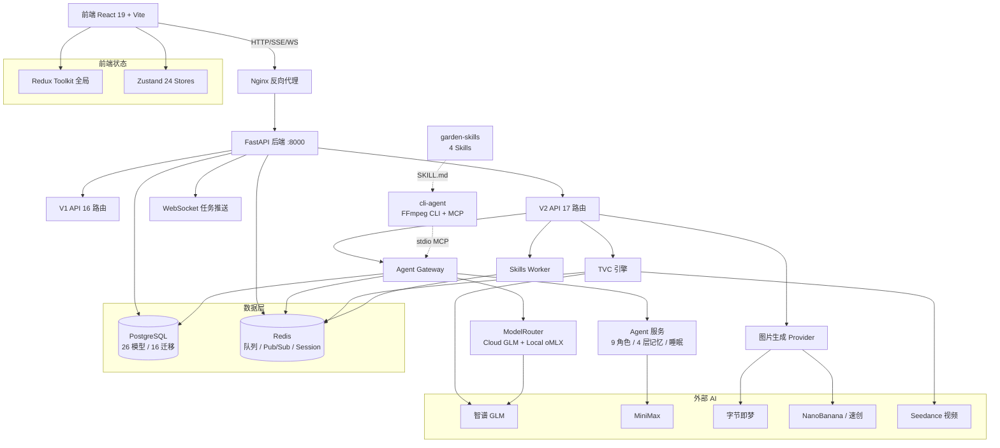

# NanoAiCanvas - 无限画布创作平台

> 基于 React Flow 的无限画布 Workflow 任务工作流系统，支持多 AI 服务集成

**项目版本**: 2.13.63
**最后更新**: 2026-09-01
**技术栈**: React 19.2.4 + TypeScript 5.9.3 + Vite 5.2.11 + FastAPI + PostgreSQL + Redis
**Agent 系统**: Nanoai Team8 V0.3.0（自进化短剧创作 Agent Team）
**线上入口**: https://91zm.com.cn/nanoai（43.129.205.22 轻量机 + Caddy 子路径反代 + 知命主站共存）

---

## 变更记录 (Changelog)

### 2026-09-01 晚间 - 生产部署完成（91zm.com.cn/nanoai 上线 .22）+ 全链路验证

**部署成果（v2.13.36 → 2.13.63，9+ commits）**：
- 生产机：43.129.205.22（9aizm 轻量 2C/3.6G，Debian）+ 2G swap；SSH：`ssh -i ~/.ssh/id_ed25519_zhiming root@43.129.205.22`
- 架构：Caddy（知命栈，`/nanoai/*` handle）→ nanoai-nginx-1:80（加入 deploy_default 网络）→ frontend:3000 / backend:8000；5 容器 + pg/redis
- 代码 `/opt/nanoai`（GitHub main 同步）；`docker-compose.override.yml` 接 Caddy 网络（git 不冲突）

**关键修复（全部推 main）**：
- 容器构建：corepack pin `pnpm@10.33.0`（11.25 与 node20 不兼容）；pytest 8.3.3 + pytest-asyncio 0.24.0；package.json 补回 zustand^4.5.7（幽灵依赖）
- 数据库：空库 alembic 链三 bug — api_keys 族表无迁移（upgrade 010 + create_all 手建 + stamp 011）、014_tvc team_id Integer→UUID、015 agent_tasks 索引重复
- skills_worker.py：logger 定义误入 docstring（NameError）
- frontend.Dockerfile：Vite base=/nanoai 产物挪 `mv dist /pub/nanoai`（消除 try_files 循环 500）
- deploy/nginx-outer.conf：补 /nanoai 前缀 API 子路径剥前缀转发（/nanoai/api|v2|ws|uploads|health → backend）
- Caddyfile 双副本坑：必须改 `/opt/zhiming/repo/deploy/Caddyfile` 源头 + commit，否则被知命自动部署覆盖还原

**E2E 验证**：注册 200 落库（pending→active）→ UI 登录 → 登录态（用户名+已同步）；测试账号已清理

**已知运维注意**：内存 3.6G 跑 8 容器（监控 OOM）；Caddy/nginx 单文件挂载改配置后须 `docker restart`/`--force-recreate`（inode 问题）

### 2026-09-01 - 增量索引更新（/nanoai 子路径迁移 + 91zm 香港生产环境）

**版本与部署**：
- 项目版本：2.13.30 → **2.13.36**（package.json 实测）
- 前端子路径迁移：`/nanoaicanvas` → **`/nanoai`**（commit c8201f1）：Vite `base: '/nanoai/'` + 路由 + 资源路径全量迁移，dev proxy 全部改为 `/nanoai/*` 前缀
- 生产 API 基址修复（commit 8a1d0fa）：前端同源相对路径（`client.ts` 默认空 base）+ Nginx 剥离 `/nanoai` 前缀反代后端
- 腾讯云香港生产环境上线：主机 nanoai-hk-2 + 域名 **91zm.com.cn** + HTTPS + `/nanoai` 入口
- 新增 `deploy/conf/nginx-91zm.conf`（91zm 域名宿主机反代 Docker HOST_PORT=8080，含 WS 升级 + SSE 关闭缓冲 + 100m 上传）
- 新增 `deploy/setup-adguard-dns.sh`（AdGuard DNS 服务部署）

**关键实现位置（本次实测核实）**：
- `src/lib/basePath.ts`：`BASE_PATH = '/nanoai'` + `getFullPath()`（子路径统一入口）
- `vite.config.ts`：`base: '/nanoai/'` + dev proxy `/nanoai/api|/nanoai/v2|/nanoai/ws|/nanoai/auth|...`（rewrite 剥前缀）
- `src/lib/api/client.ts`：`API_BASE_URL = VITE_API_BASE_URL || ''`（生产同源相对路径）

**文档更新**：
- 根 CLAUDE.md：changelog + 版本 + 线上入口 + 部署段补充
- `deploy/CLAUDE.md`：补 nginx-91zm.conf、香港生产拓扑（91zm.com.cn）、文件统计修正

**核对无变化（2026-09-01 实测）**：
- Zustand Stores 24（24 源 + 24 测试）✓ / lib/api 测试 12 ✓ / Hooks 18 + 8 测试 ✓
- garden-skills 4 skills ✓ / 模块 CLAUDE.md 17 个 ✓（均无 `/nanoaicanvas` 旧路径引用，源码中残留旧路径仅存于 e2e/*.spec.ts、frontend.Dockerfile、deploy 旧配置，属源代码不在文档范围）

**仓库卫生建议（沿袭 2026-08-28，仅建议）**：
- `11/`：cultural_visit 媒体产物目录，建议移出仓库并加入 .gitignore
- `docs/guides/GPT-API.md`：GPT-Image-2 API 参考已移入 docs/guides/（根目录 GPT-API.md 建议删除避免双份）

### 2026-08-28 - 增量索引更新（Scripts 媒体制作脚本模块 + Stores 统计修正）

**新增模块索引（scripts/，6 文件）**：
- `ahma_love_letter.py`：阿嬷的情书短视频制作管线（storyboard → GPT-Image-2 生图 → zoompan → xfade）
- `cultural_visit_video.py`：文化探访短视频制作器（MiniMax 多模态文案 + FFmpeg 幻灯片合成）
- `add-ws-location.py` / `check-root-dir.sh` / `test-image-api.py` / `version.sh`：杂项工具

**统计修正（2026-08-28 实测核对）**：
- Zustand Stores：23 → **24**（appsConfigStore 应用配置：多应用模型配置 + persist 持久化），测试 22 → **24**（24/24 全覆盖）
- lib/api 测试：11 → **12**（含 tvc-api.test.ts）
- 架构图与模块结构图：Zustand 23 → 24 Stores

**核对无变化**：
- `package.json` version 2.13.30 ✓ / garden-skills 4 skills ✓ / deploy 11 脚本 + 7 测试 ✓（2026-08-11 已记录，本次无增量）

**仓库卫生建议**（仅建议，未执行）：
- `11/`：cultural_visit 媒体产物目录（mp4 / 照片 / 字幕 JSON），建议移出仓库并加入 .gitignore
- `GPT-API.md`：GPT-Image-2 API 参考文档（wuyinkeji 代理），按目录管理规则建议移至 `docs/GPT-API.md`

### 2026-08-11 - 自适应索引增量更新（测试体系 + 部署工具链 + Agent 模块文档）

本次为**增量扫描**，聚焦自上次更新（2026-05-20）以来的新增内容，未重写既有结构。

**新增模块文档（3 个）**：
- 新增 `backend/app/services/agent/CLAUDE.md` — Agent 系统（9 角色 / 4 层记忆 / 6 阶段睡眠 / 8 阶段管线 / 双模型路由 / 5 MCP Tools / 17 路由 / 7 张数据表）
- 新增 `deploy/CLAUDE.md` — 部署运维工具链（LXC 裸机 + Docker Compose + Nginx + HTTPS + DNS + 备份 + 日志轮转 + 7 维度部署测试）
- 新增 `backend/tests/CLAUDE.md` — 后端测试体系（unit / agent / integration 三层 + conftest 分层 mock 策略）

**前端测试体系扩展（46 个新测试文件）**：
- `src/stores/*.test.ts` × 22（覆盖全部 23 Zustand Store）
- `src/hooks/*.test.ts` × 8（useCanvasHistory / useIMETextarea / useToast 等）
- `src/lib/api/*.test.ts` × 11（client / chat / agent / points / tvc 等核心 API）
- `src/components/nanoai-workflow/nodes/*.test.ts(x)` × 2（StoryboardShotANode + useTvcExecution）
- `src/lib/api/tvc-api.test.ts` × 1
- 测试配置：`src/test/setup.ts`（Mock localStorage / fetch / EventSource / IntersectionObserver / ResizeObserver / matchMedia）
- Vitest 配置：`vitest.config.ts`（globals + jsdom + `@/` 路径别名）

**后端测试体系扩展（8 个新测试文件 + pytest.ini）**：
- 新增 `backend/pytest.ini`（asyncio_mode=auto + testpaths=tests）
- 新增 `backend/tests/unit/`（6 文件）：points_service / api_key_service / model_scanner / workflow_executor / video_thumbnail / pubsub
- 新增 `backend/tests/agent/`：test_agent_system.py（9 Agent 完整性 + 记忆半衰期 + 管线状态机 + 模型路由 + BaseAgent）
- conftest 三层分层：根（集成，连真实 PG）+ unit（mock asyncpg）+ agent（_TestBase 替身 + mock redis/config）

**部署运维工具链（17 脚本 + 7 测试 + 2 配置）**：
- LXC 部署链：`pve-create-lxc.sh` → `lxc-setup.sh` → `lxc-deploy.sh`（7 步裸机部署）
- Docker 部署：`deploy.sh`（一键 up/update/down/logs）
- 运维脚本：`backup-restore.sh`（PG 备份/恢复/cron）+ `setup-https.sh`（Let's Encrypt）+ `setup-dns.sh` / `setup-adgrid-dns.sh` + `setup-logrotate.sh`
- 部署测试：`test-deploy.sh` + `tests/01-network.sh ~ 07-stress.sh`（7 维度验证，支持 `--html` 报告）
- 配置：`conf/nginx-nanoai.conf` + `conf/nanoai-backend.service`（systemd）

**根级文档更新**：
- 项目版本：`2.13.1` → `2.13.30`
- 嵌入 Mermaid **架构总览图**与**模块结构图**（可点击导航到各模块 CLAUDE.md）
- 模块索引补充 `backend/app/services/agent/`、`deploy/`、`backend/tests/` 三处文档链接
- 更新测试策略：前端 Vitest / 后端三层 Pytest / CLI Vitest
- 更新扫描覆盖率统计

**索引与覆盖率**：
- 前端 TS/TSX 源文件：约 470 个（含 46 个测试）
- 后端 Python 文件：约 146 个（含 12 个测试）
- 已识别模块：22 个（含 17 个有 CLAUDE.md）
- 本次新增文档：3 个模块 CLAUDE.md + 根 CLAUDE.md 增量更新

### 2026-05-20 - Nanoai Team8 Agent System V0.3.0（自进化短剧创作 Agent Team）
- 新增 9 角色化 Agent Team：Producer / Screenwriter / Director / ArtDirector / CharacterDesigner / SceneDesigner / VoiceDirector / Editor / Composer
- 新增 4 层记忆栈（L0 Identity → L1 Essential → L2 On-Demand → L3 Deep Search），Stability 半衰期评分 + 自动修剪
- 新增 6 阶段睡眠模式：review_memories → prune → skill_review → efficiency_optimization → validation → report
- 新增 Git 式用户分支技能系统：fork/diff/pull/push/merge
- 新增 Gateway 网关模式：Redis BRPOP 任务队列 + REST API + WebSocket + MCP stdio 桥接
- 新增双模型路由：Cloud（GLM API）+ Local（oMLX localhost:11434）
- 新增 8 阶段改编管线：prepare → statistics → outline → plan → script → quality_control → merge → archive
- 新增效率自优化引擎（EfficiencyOptimizer）：瓶颈分析 + 失败模式检测 + 自动优化建议
- 新增 7 张数据表 + Alembic 迁移 `015_agent_system.py`：agent_sessions / agent_memories / agent_tasks / agent_execution_logs / system_skills / user_skills / skill_promotion_requests
- 新增 V2 Agent API（`agent.py`）：17 路由含 WebSocket 双向通信 + Skills CRUD
- 新增 MCP Bridge（stdio → Redis Pub/Sub）：5 Tools 对接 Claude Code / Cursor
- 新增前端 AboutDialog + agent-api.ts 客户端
- 后端 Agent 模块共 36 文件 / 3573 行（含 prompts + 配置）
- 独立版本号 V0.3.0，版权 AiHXC.Team

### 2026-05-18 - TVC双参考图重构 + 资产自动保存 + Seedance升级（v2.12.350）
- TVC 双参考图工作流重构：生图从 2N 降到 2（ShotRefImage + CharacterDesignImage → 单轮双图）
- Seedance 视频升级 2.0：模型 doubao-seedance-2-0-260128，支持 resolution(480p/720p/1080p) + duration 参数
- Seedance 隐私拦截自动去尾帧首帧重试机制
- TVC 资产自动保存：生成的图片/视频自动关联资产库
- 移除 MiniMax/CogVideoX-3 视频提供者，Seedance 为唯一视频提供者
- 简化视频生成逻辑，移除冗余 fallback/provider 抽象
- 后端新增 `video_thumbnail.py` 视频关键帧缩略图服务（FFmpeg 提取）
- 前端新增 `video-editor-api.ts` 视频编辑 API 客户端
- 团队积分优先扣减机制：先团队后个人，不足时需确认
- 后端新增 `seedance_constants.py` Seedance 常量配置
- API 客户端从 40+ 增长到 43+

### 2026-05-18 - 视频合成 CLI + AI 剪辑 Chat（v2.12.313）
- 新增 cli-agent/ 独立子包（18 文件，1281 行）
- FFmpeg 7 操作封装：concat/amix/overlay/subtitles/normalize/compare/extractAudio
- 4 阶段管线编排：拼接→对比→字幕→混音+多规格（1080p+4K）
- CLI 5 命令：compose/concat/compare/subtitle/bgm + mcp + serve
- MCP Server（stdio）：4 Tools（compose/concat/compare/status）
- Fastify HTTP API：compose/tasks/health
- VideoComposeSkill 标准接口（可对接不同 Agent）
- 前端 VideoChatPanel 可复用对话组件（244 行）
- 前端 StoryboardVideoPanel Tab 面板集成到 TVC 第3节点属性面板
- 后端 glm_proxy 新增 `POST /tvc-video-agent` + `POST /tvc-video-agent/stream`（SSE）
- Agent 使用 glm-4.5-air 解析用户意图返回结构化 JSON 指令
- WorkflowPropertiesPanel 从 1256→1199 行（内联替换为组件引用）
- cli-agent 测试 9 + 前端测试 23 = 32 全通过，Vite 构建通过

### 2026-05-17 - TVC项目管理 + 模型检测 + 资产库升级（v2.12.312）
- 新增 TVC 项目数据模型（`TvcProject` + `TvcProjectShot`）：项目级组织，关联文案→剧本→镜头→成片
- 新增 TVC 项目管理 API（`tvc_projects.py`）：CRUD + 镜头管理 + 任务结果关联
- 新增 V2 资产库 API（`library.py`）：资产浏览/搜索/批量操作
- 新增 API Key 模型扫描服务（`model_scanner.py`）：按 Provider 类型检测可用模型并标记
- 新增 Alembic 迁移 `014_tvc_projects.py`、`014_api_key_detected_models.py`
- 新增前端 TVC 项目面板（`TvcProjectPanel` + `TvcProjectDetail`）
- 新增团队资产导入组件（`TeamAssetImport`）
- 新增前端 API 客户端 `tvc-projects-api.ts`
- 新增管理后台页面 `tvc-config`
- User 模型新增 `tvc_projects` 关系
- 数据模型从 17 个增长到 19 个
- **扫描覆盖率：100%（530+ 核心文件）**

### 2026-05-17 - TVC配置管理 + 模型切换（v2.12.308）
- 新增 TVC 工作流配置 API（`tvc_config.py`）：全局配置+用户配置+配置解析
- 新增 TVC 配置数据模型（`TvcWorkflowConfig`）：scope 区分 global/user
- 新增 Alembic 迁移 `013_tvc_workflow_configs.py`
- MiniMax 视频模型切换为 Hailuo-2.3-Fast（高速版 768P），适配 Token Plan 套餐
- MiniMax API 路径重复 `/api` 前缀 404 修复
- 深度分析优化模式恢复使用 GLM-5.1 模型
- 积分不足 toast 文案断言修正
- 新增工作流模板 `textToImageWorkflow.ts`
- **扫描覆盖率：100%（500+ 核心文件）**

### 2026-05-15 - TVC模块重构 + Hooks扩展（v2.12.301）
- TVC 后端拆分为 3 个独立模块：`tvc_engine.py`（执行引擎+积分管理）、`tvc_polling.py`（视频轮询）、`tvc_providers.py`（Provider工厂）
- TVC 脚本生成切换为 MiniMax M2.7 模型
- TVC 视频默认模型改为 MiniMax Hailuo
- 深度分析优化模式恢复使用 GLM-5.1 模型
- TVC V1 节点重构 + FFmpeg 合成端点
- Hooks 从 3 个扩展到 18 个（新增 ChatSocket、MQTT、IME、通知、性能模式等）
- 后端新增 TVC 引擎/Provider 单元测试
- **扫描覆盖率：100%（500+ 核心文件）**

### 2026-05-14 - 全面项目结构更新（v2.12.273）
- 版本从 2.4.1 大幅升级到 2.12.273
- 新增管理后台系统（25+ 页面）：用户/团队/积分/模型/渠道商/Key池/通知等
- 新增 Garden Skills 插件生态（4 skills：gpt-image-2, kb-retriever, web-design-engineer, web-video-presentation）
- 新增后端 V2 API：admin CRUD, key_mapper, generation_log, skills, workflow_tasks(TVC), app_visibility
- 新增后端服务层：workflow_executor, skills_worker, task_queue, api_key_service, pubsub
- 新增 Providers 系统统一 AI 服务调用（wuyinkeji, caohua_jimeng）
- 新增 Chat 系统：REST + WebSocket + Redis Pub/Sub 跨 Worker 消息分发
- 新增 15 个 Zustand Stores（从 7 个增长到 22 个）
- 新增 18 个自定义 Hooks
- 新增 40+ API 客户端模块
- 新增 7 个 Workflow 节点（TVC, Skills, Output 等）
- 新增 8 个后端数据模型
- 更新 12 个 Alembic 迁移版本
- **扫描覆盖率：100%（480+ 核心文件）**

### 2026-05-05 - 完整项目结构更新（含后端）
- 识别双仓库结构：前端（src/）+ 后端（backend/）
- 更新技术栈：React + FastAPI 全栈架构
- **扫描覆盖率：100%（200+ 核心文件）**

### 2026-04-22 - 完整 AI 上下文文档系统（深度扫描版）
- 完成全仓清点和模块结构分析
- **扫描覆盖率：100%（93+ 核心文件）**

---

## 项目愿景

**NanoAiCanvas** 是一个现代化的无限画布应用，专注于提供流畅的节点编辑体验。项目灵感来源于 Figma 的设计理念，采用 Base Nova 暗色主题，支持中英文国际化，并集成了强大的 AI 工作流功能。

### 核心特性

- **无限画布**: 基于 React Flow，支持平滑缩放、平移、小地图导航
- **49 节点类型**: 输入、AI 生成、决策、处理、输出、MiniMax、即梦、GLM、Qwen、Kimi、TVC、Skills 等
- **24 内置模板**: 6 基础模板 + 18 Skills 模板
- **管理后台**: 25+ 管理页面，用户/团队/积分/模型/渠道商/TVC配置全流程管理
- **Garden Skills**: 4 个 Skills 插件 + 90+ 参考模板
- **Chat 系统**: 实时聊天 + WebSocket + 文件上传 + Redis Pub/Sub
- **双重状态管理**: Redux Toolkit（全局）+ Zustand（Workflow/业务）
- **后端 V2 API**: 多 Provider 图片生成、Key 映射、TVC 项目管理、Skills 队列
- **积分系统**: 自动计价引擎 + 余额校验 + 统计仪表盘
- **主题系统**: Base Nova 暗色主题 + OKLCH 颜色空间
- **国际化**: 完整的中英文切换支持
- **插件系统**: 支持自定义节点类型和 Skills 扩展
- **Agent 系统**: Nanoai Team8 自进化短剧创作 Agent Team（9 角色 + 4 层记忆 + 睡眠自优化）
- **部署工具链**: LXC 裸机 + Docker Compose + HTTPS + DNS + 备份 + 日志轮转 + 7 维度部署测试 + 腾讯云香港生产（91zm.com.cn/nanoai）
- **子路径部署**: Vite base `/nanoai/` + `src/lib/basePath.ts` 统一前缀 + Nginx 剥前缀反代（`/nanoaicanvas → /nanoai` 已于 v2.13.3x 完成迁移）

---

## 技术栈

### 前端（src/）

| 技术 | 版本 | 用途 |
|------|------|------|
| **React** | 19.2.4 | UI 框架 |
| **TypeScript** | 5.9.3 | 类型系统（严格模式） |
| **Vite** | 5.2.11 | 构建工具（base: `/nanoai/`） |
| **Redux Toolkit** | 2.2.5 | 全局状态管理 |
| **Zustand** | latest | Workflow + 业务状态管理 |
| **React Flow** | 11.11.4 | 无限画布核心 |
| **Vitest** | 1.6.1 | 单元测试 + 覆盖率 |
| **Playwright** | 1.59.1 | E2E 测试 |

### 后端（backend/）

| 技术 | 版本 | 用途 |
|------|------|------|
| **FastAPI** | 0.109.2 | Web 框架 |
| **SQLAlchemy** | 2.0.25 | ORM（async） |
| **PostgreSQL** | - | 主数据库 |
| **Redis** | 5.0.1 | Session/队列/Pub/Sub |
| **Pytest** | 8.0.0 | 测试框架（unit/agent/integration 三层） |
| **Alembic** | 1.13.1 | 数据库迁移（16 版本） |

### 子包

| 子包 | 路径 | 用途 |
|------|------|------|
| **cli-agent** | `cli-agent/` | FFmpeg 视频合成 CLI + MCP Server + Fastify HTTP（独立 package.json，Vitest 1.6.1） |
| **garden-skills** | `garden-skills/` | SKILL.md 兼容 Agent 技能集合（4 skills，独立 package.json） |

---

## 架构总览



> Mermaid 源文件：直接嵌入本文档；历史 SVG 见 `docs/diagrams/architecture.svg`、`docs/diagrams/architecture.mmd`

---

## 模块结构图

```mermaid
graph TD
    ROOT["(根) NanoAiCanvas"] --> SRC["src/ 前端"]
    ROOT --> BE["backend/ 后端"]
    ROOT --> DEPLOY["deploy/ 部署运维"]
    ROOT --> CLI["cli-agent/ 视频合成 CLI"]
    ROOT --> GARDEN["garden-skills/ 插件生态"]
    ROOT --> TESTS_BE["backend/tests/ 后端测试"]

    SRC --> WF["nanoai-workflow<br/>49 节点 + 24 模板"]
    SRC --> STORES["stores<br/>24 Zustand"]
    SRC --> HOOKS["hooks<br/>18 个 + 8 测试"]
    SRC --> APICLIENT["lib/api<br/>43 客户端 + 11 测试"]
    SRC --> APP["app/<br/>26+ Admin 页面"]

    BE --> API_V1["api/ V1 16 路由"]
    BE --> API_V2["api/v2/ V2 17 路由"]
    BE --> SERVICES["services/<br/>11 业务服务"]
    BE --> AGENT_SYS["services/agent/<br/>Team8 V0.3.0"]
    BE --> MODELS["models/<br/>26 模型类"]
    BE --> ALEMBIC["alembic/<br/>16 迁移版本"]

    DEPLOY --> LXC["LXC 裸机部署链"]
    DEPLOY --> DOCKER["Docker Compose"]
    DEPLOY --> OPS["backup/https/dns/logrotate"]
    DEPLOY --> DEPLOYTEST["tests/ 7 维度测试"]

    click WF "./src/components/nanoai-workflow/CLAUDE.md" "查看 nanoai-workflow 文档"
    click STORES "./src/stores/CLAUDE.md" "查看 Stores 文档"
    click HOOKS "./src/hooks/CLAUDE.md" "查看 Hooks 文档"
    click APICLIENT "./src/lib/api/CLAUDE.md" "查看 API 客户端文档"
    click API_V1 "./backend/app/api/CLAUDE.md" "查看 V1 API 文档"
    click API_V2 "./backend/app/api/v2/CLAUDE.md" "查看 V2 API 文档"
    click SERVICES "./backend/app/services/CLAUDE.md" "查看 Services 文档"
    click AGENT_SYS "./backend/app/services/agent/CLAUDE.md" "查看 Agent 系统文档"
    click MODELS "./backend/app/models/CLAUDE.md" "查看 Models 文档"
    click TESTS_BE "./backend/tests/CLAUDE.md" "查看后端测试文档"
    click DEPLOY "./deploy/CLAUDE.md" "查看部署运维文档"
    click CLI "./cli-agent/CLAUDE.md" "查看 cli-agent 文档"
    click GARDEN "./garden-skills/CLAUDE.md" "查看 garden-skills 文档"
```



> Mermaid 源文件：直接嵌入本文档；历史 SVG 见 `docs/diagrams/module-structure.svg`、`docs/diagrams/module-structure.mmd`

---

## 模块索引

### 前端模块（src/）

| 模块 | 路径 | 职责 | 文档 |
|------|------|------|------|
| **NanoAI Workflow** | `src/components/nanoai-workflow` | AI 工作流核心，49 节点 + 6 基础模板 + 18 Skills 模板 + 2 节点测试 | [查看](./src/components/nanoai-workflow/CLAUDE.md) |
| **Admin 组件** | `src/components/admin` | 管理后台 UI 组件（apps / kevin 监控等） | [查看](./src/components/admin/CLAUDE.md) |
| **Storyboard** | `src/components/storyboard` | 故事板面板，25 组件 | [查看](./src/components/storyboard/CLAUDE.md) |
| **Canvas** | `src/components/canvas` | 无限画布基础组件 | [查看](./src/components/canvas/CLAUDE.md) |
| **Panels** | `src/components/panels` | 属性面板和模板面板 | [查看](./src/components/panels/CLAUDE.md) |
| **Toolbar** | `src/components/toolbar` | 顶部工具栏 | - |
| **Collaboration** | `src/components/collaboration` | 协作光标 + 编辑冲突 | - |
| **UI Components** | `src/components/ui` | shadcn/ui 基础组件（含 AssetLibrary） | [查看](./src/components/ui/AssetLibrary/CLAUDE.md) |
| **Edges** | `src/components/edges` | 自定义边连线 | - |
| **Animations** | `src/components/animations` | 动画组件 | - |
| **Zustand Stores** | `src/stores` | 24 个业务状态管理 + 24 测试文件 | [查看](./src/stores/CLAUDE.md) |
| **Redux Store** | `src/store` | 全局状态管理 | [查看](./src/store/CLAUDE.md) |
| **Hooks** | `src/hooks` | 18 个自定义 Hooks + 8 测试（自动保存、ChatSocket、IME、MQTT、通知等） | [查看](./src/hooks/CLAUDE.md) |
| **Lib/API** | `src/lib/api` | 43 API 客户端模块 + 12 测试（client / chat / agent / points / tvc 等） | [查看](./src/lib/api/CLAUDE.md) |
| **Lib/BasePath** | `src/lib/basePath.ts` | 子路径统一入口：`BASE_PATH='/nanoai'` + `getFullPath()` | - |
| **Lib/DB** | `src/lib/db` | IndexedDB 本地存储 | - |
| **Lib/Sync** | `src/lib/sync` | 离线同步 | - |
| **Types** | `src/types` | TypeScript 类型定义 | [查看](./src/types/CLAUDE.md) |
| **Locales** | `src/locales` | 国际化 zh-CN/en-US | - |
| **App Pages** | `src/app` | 页面路由（admin 26+ 页面，挂载于 `/nanoai` 子路径） | [查看](./src/app/CLAUDE.md) |
| **Config** | `src/config` | 快捷键 / 应用配置 | [查看](./src/config/CLAUDE.md) |
| **Test Setup** | `src/test/setup.ts` | Vitest 全局 mock（localStorage / fetch / EventSource / Observer） | - |
| **Scripts** | `scripts/` | AI 媒体制作脚本：文化探访短视频 / 阿嬷情书管线（GPT-Image-2 + FFmpeg）+ 杂项工具 | - |

### 后端模块（backend/）

| 模块 | 路径 | 职责 | 文档 |
|------|------|------|------|
| **V1 API** | `backend/app/api/` | 核心业务 API（16 路由） | [查看](./backend/app/api/CLAUDE.md) |
| **V2 API** | `backend/app/api/v2/` | 新版 API（17 路由，含 Agent API 17 路由） | [查看](./backend/app/api/v2/CLAUDE.md) |
| **Agent System** | `backend/app/services/agent/` | Nanoai Team8 V0.3.0 自进化 Agent（9 角色 + 4 层记忆 + 6 阶段睡眠 + 8 阶段管线 + 双模型路由 + 5 MCP Tools） | [查看](./backend/app/services/agent/CLAUDE.md) |
| **Services** | `backend/app/services/` | 业务服务层（11 服务 + Skills 子系统） | [查看](./backend/app/services/CLAUDE.md) |
| **Providers** | `backend/app/providers/` | AI 服务提供商（wuyinkeji / caohua_jimeng） | [查看](./backend/app/providers/CLAUDE.md) |
| **Models** | `backend/app/models/` | 18 模型文件 / 26 模型类（含 Agent 7 模型 + Points 3 模型） | [查看](./backend/app/models/CLAUDE.md) |
| **Points Model** | `backend/app/models/points/` | 积分系统（Team / PointsAccount / PointsTransaction） | [查看](./backend/app/models/points/CLAUDE.md) |
| **Core** | `backend/app/core/` | 安全 / 配置工具 | - |
| **CLI** | `backend/app/cli/` | 命令行工具 | - |
| **Alembic** | `backend/alembic/` | 16 个数据库迁移（001-015，014 双版本） | - |
| **Backend Tests** | `backend/tests/` | 三层测试（unit 6 + agent 1 + 集成 6 + 3 conftest） | [查看](./backend/tests/CLAUDE.md) |
| **Pytest Config** | `backend/pytest.ini` | asyncio_mode=auto + testpaths=tests | - |

### 部署运维模块

| 模块 | 路径 | 职责 | 文档 |
|------|------|------|------|
| **Deploy** | `deploy/` | LXC 裸机 + Docker Compose + HTTPS + DNS + 备份 + 日志 + 7 维度测试 + 91zm.com.cn 香港生产反代 | [查看](./deploy/CLAUDE.md) |

### Garden Skills 模块

| 模块 | 路径 | 职责 |
|------|------|------|
| **Garden Skills** | `garden-skills/` | 插件生态根（4 skills，独立 package.json） | [查看](./garden-skills/CLAUDE.md) |
| **GPT-Image-2** | `garden-skills/skills/gpt-image-2/` | AI 图片生成 Skill，90+ 参考模板 |
| **KB-Retriever** | `garden-skills/skills/kb-retriever/` | 知识库检索 Skill |
| **Web-Design** | `garden-skills/skills/web-design-engineer/` | Web 设计工程 Skill |
| **Web-Video** | `garden-skills/skills/web-video-presentation/` | Web 视频演示 Skill |

### CLI Agent 模块

| 模块 | 路径 | 职责 | 文档 |
|------|------|------|------|
| **Core** | `cli-agent/src/core/` | FFmpeg 7 操作 + 4 阶段管线编排 + 配置管理 | [查看](./cli-agent/CLAUDE.md) |
| **CLI** | `cli-agent/src/cli/` | 7 个命令：compose/concat/compare/subtitle/bgm + mcp + serve | [查看](./cli-agent/CLAUDE.md) |
| **MCP Server** | `cli-agent/src/mcp/` | MCP stdio Server（4 Tools） | - |
| **HTTP API** | `cli-agent/src/api/` | Fastify 服务（compose/tasks/health） | - |
| **Skill** | `cli-agent/src/skill/` | VideoComposeSkill 标准接口 | - |

---

## Workflow 工作流系统

### 节点类型（49）

| 类别 | 节点类型 | 描述 |
|------|----------|------|
| **输入** | `input_text`, `input_image` | 文本/图片输入 |
| **AI 生成** | `script_generator`, `storyboard_generator`, `dialogue_generator`, `character_designer`, `scene_designer` | 故事板相关生成 |
| **TVC** | `tvc_script`, `storyboard_video`, `video_generator` | TVC 广告视频生成 |
| **故事板** | `storyboard_shot_a`, `storyboard_v2`, `storyboard_script_table`, `shot_ref_image` | 故事板分镜节点 |
| **Skills** | `skills_data`, `skills_task` | Skills 任务节点 |
| **MiniMax** | `minimax_text`, `minimax_speech`, `minimax_video`, `minimax_music`, `minimax_image`, `minimax_coding` | MiniMax 全套 AI |
| **图片生成** | `nano_banana_2`, `nano_banana_pro`, `gpt_image_2` | NanoBanana / GPT-Image |
| **即梦** | `jimeng_image`, `jimeng_video` | 字节 AI |
| **智谱 GLM** | `glm_text`, `glm_video`, `glm_tts`, `glm_multimodal` | 智谱 AI |
| **通义千问** | `qwen_text`, `qwen_coding` | 阿里 AI |
| **Kimi** | `kimi_text` | Moonshot AI |
| **预览** | `image_preview`, `video_preview`, `audio_preview`, `text_preview`, `output` | 结果预览/输出 |
| **其他** | `director_agent`, `screenwriter_agent`, `milestone`, `background_music`, `transition`, `connector` | 代理/工具节点 |

### 内置模板（24: 6 基础 + 18 Skills）

1. **storyboard-01** - 故事板01（完整流程）
2. **character-workflow** - 角色设计工作流
3. **scene-workflow** - 场景设计工作流
4. **quick-storyboard-v2** - 快速分镜
5. **tvc-video-01** - TVC 广告视频制作
6. **text-to-image** - 文生图工作流
7-24. **Skills 模板**（18个）: academic / assets / avatars / branding / complete / editing / grids / infographics / maps / portraits / poster / product-visuals / scenes / slides / storyboards / technical / typography / ui-mockups

---

## 后端 API 结构

### V1 API 路由（/api）

| 路由 | 文件 | 功能 |
|------|------|------|
| `/api/auth/*` | `auth.py` | 注册/登录/JWT/刷新 |
| `/api/assets/*` | `assets.py` | 资产管理 CRUD |
| `/api/workflows/*` | `workflows.py` | 工作流保存/加载 |
| `/api/points/*` | `points.py` | 积分查询/扣减 |
| `/api/points_admin/*` | `points_admin.py` | 积分管理后台 |
| `/api/categories/*` | `categories.py` | 自定义分类 |
| `/api/teams/*` | `teams.py` | 团队管理 |
| `/api/sync/*` | `sync.py` | 离线数据同步 |
| `/api/assets_export/*` | `assets_export.py` | 批量导出 |
| `/api/prompt_restrictions/*` | `prompt_restrictions.py` | 提示词限制 |
| `/api/admin_users/*` | `admin_users.py` | 用户管理后台 |
| `/api/notifications/*` | `notifications.py` | 通知推送 |
| `/api/tags/*` | `tags.py` | 标签管理 |
| `/api/folders/*` | `folders.py` | 文件夹管理 |
| `/chat/*` | `chat.py` | 即时聊天 + WebSocket |

### V2 API 路由（/api/v2）

| 路由 | 文件 | 功能 |
|------|------|------|
| `/api/v2/admin/*` | `admin.py` | 渠道商/模型/Key/用量 CRUD |
| `/api/v2/admin/key-mapper/*` | `key_mapper.py` | 前后端 API Key 映射 |
| `/api/v2/admin/app-visibility/*` | `app_visibility.py` | 应用可见性配置 |
| `/v2/image/*` | `image.py` | 多 Provider 图片生成 |
| `/api/v2/skills/*` | `skills.py` | Skills 队列式生成 |
| `/api/v2/tvc-tasks/*` | `workflow_tasks.py` | TVC 工作流任务 |
| `/api/v2/tvc-engine/*` | `tvc_engine.py` | TVC 执行引擎+积分管理 |
| `/api/v2/tvc-providers/*` | `tvc_providers.py` | TVC Provider 工厂 |
| `/api/v2/tvc-polling/*` | `tvc_polling.py` | TVC 视频结果轮询 |
| `/api/v2/tvc-config/*` | `tvc_config.py` | TVC 工作流配置管理 |
| `/api/v2/glm-proxy/*` | `glm_proxy.py` | GLM 提示词优化代理 + 视频剪辑 Agent |
| `/api/v2/minimax-proxy/*` | `minimax.py` | MiniMax 文本代理 |
| `/api/v2/generation-logs/*` | `generation_log.py` | 生成任务日志 |
| `/api/v2/tvc-projects/*` | `tvc_projects.py` | TVC 项目管理 CRUD + 镜头管理 |
| `/api/v2/library/*` | `library.py` | V2 资产库浏览/搜索/批量操作 |
| `/api/v2/agent/*` | `agent.py` | Agent 系统 API（17 路由含 WS/Skills/Pipeline） |
| - | `seedance_constants.py` | Seedance 视频常量配置 |

### 后端服务层

| 服务 | 文件 | 描述 |
|------|------|------|
| **WorkflowExecutor** | `services/workflow_executor.py` | TVC 工作流执行器：异步5步线性流程，Redis存储进度+断点续传，SSE实时推送 |
| **SkillsWorker** | `services/skills_worker.py` | Redis 队列消费，步骤化图片生成 |
| **TaskQueue** | `services/task_queue.py` | 任务队列管理 |
| **ApiKeyService** | `services/api_key_service.py` | API Key 热加载（60s 缓存） |
| **PointsService** | `services/points_service.py` | 积分自动计价引擎 |
| **PubSub** | `services/pubsub.py` | Redis Pub/Sub 封装 |
| **HealthChecker** | `services/health_checker.py` | API Key 健康检查 |
| **ModelScanner** | `services/model_scanner.py` | API Key 模型检测（按 Provider 类型扫描可用模型） |
| **ImageDownloader** | `services/image_downloader.py` | 图片下载服务 |
| **EmailService** | `services/email.py` | 邮件发送 |
| **VideoThumbnail** | `services/video_thumbnail.py` | 视频关键帧缩略图（FFmpeg 提取） |

### Agent 服务层（backend/app/services/agent/）

| 服务 | 文件 | 描述 |
|------|------|------|
| **AgentGateway** | `gateway.py` | 网关主循环：Redis BRPOP 消费 + Pipeline/Chat 路由 + 睡眠调度 |
| **AdaptationPipeline** | `pipeline.py` | 8 阶段改编管线：prepare→statistics→outline→plan→script→quality_control→merge→archive |
| **ModelRouter** | `model_router.py` | 双模型路由：Cloud(GLM) + Local(oMLX)，支持 stream/non-stream |
| **MemoryStack** | `memory_stack.py` | 4 层记忆栈：L0-L1 文件系统 + L2-L3 PostgreSQL，Stability 半衰期评分 |
| **SkillsRegistry** | `skills_registry.py` | Git 式技能生命周期：fork/diff/pull/push/merge/promotion |
| **SleepScheduler** | `sleep/scheduler.py` | 6 阶段睡眠调度器：记忆回顾→修剪→技能审查→效率优化→验证→报告 |
| **EfficiencyOptimizer** | `sleep/efficiency_optimizer.py` | 效率自优化引擎：5 维分析（瓶颈/失败/成功/Token异常/模型对比） |
| **AutoUpdater** | `sleep/auto_updater.py` | 安全自动更新：仅修改 prompt 注释 + YAML 配置建议 |
| **MCP Bridge** | `mcp/bridge.py` | MCP stdio 桥接：5 Tools via Redis Pub/Sub |

### Agent 角色（9 个）

| 角色 | 文件 | 职责 | 模型 |
|------|------|------|------|
| **ProducerAgent** | `agents/producer.py` | 全局编排、状态机、调度 | Qwen3-30B / GLM-5 |
| **ScreenwriterAgent** | `agents/screenwriter.py` | 剧本、对白、角色塑造 | GLM-4-9B / GLM-5 |
| **DirectorAgent** | `agents/director.py` | 分镜规划、镜头语言 | GLM-4-9B / GLM-5 |
| **ArtDirectorAgent** | `agents/art_director.py` | 视觉审核 + 质量门禁 | Qwen3-7B / GLM-5 |
| **CharacterDesignerAgent** | `agents/character_designer.py` | 角色设定图 | NanoBanana2(云端) |
| **SceneDesignerAgent** | `agents/scene_designer.py` | 场景背景图 | NanoBanana2(云端) |
| **VoiceDirectorAgent** | `agents/voice_director.py` | TTS 配音 + 情绪标注 | oMLX 本地 / GLM-TTS |
| **EditorAgent** | `agents/editor.py` | 视频合成 + 转场 | Seedance(云端) |
| **ComposerAgent** | `agents/composer.py` | BGM 配乐 | MiniMax Music(云端) |

### Providers（AI 服务提供商）

| Provider | 文件 | 描述 |
|----------|------|------|
| **Base** | `providers/base.py` | Provider 基类 + 工厂模式 |
| **Wuyinkeji** | `providers/wuyinkeji.py` | 速创 API（NanoBanana 系列） |
| **Caohua-Jimeng** | `providers/caohua_jimeng.py` | 即梦 API |

### 数据模型（18 文件 / 26 类）

| 模型 | 文件 | 描述 |
|------|------|------|
| **User** | `models/user.py` | 用户（UUID, email, username） |
| **Asset** | `models/asset.py` | 资产（图片/视频/音频/文本） |
| **Workflow** | `models/workflow.py` | 工作流快照 |
| **Template** | `models/template.py` | 模板 |
| **Category** | `models/category.py` | 自定义分类 |
| **Team / PointsAccount / PointsTransaction** | `models/points.py` | 团队 + 积分账户 + 流水 |
| **ApiKey / ApiKeyConfig / BackendKeyMapping** | `models/api_key.py` | API Key 管理 + Key 映射 |
| **AppVisibility / VisibilityAuditLog** | `models/app_visibility.py` | 应用可见性 + 审计日志 |
| **Conversation / Message** | `models/conversation.py` | 聊天会话 + 消息 |
| **Folder** | `models/folder.py` | 文件夹 |
| **GenerationTaskLog** | `models/generation_log.py` | 生成任务日志 |
| **Notification** | `models/notification.py` | 通知 |
| **Operation** | `models/operation.py` | 操作日志 |
| **PromptRestriction** | `models/prompt_restrictions.py` | 提示词限制 |
| **Tag** | `models/tag.py` | 标签 |
| **TvcWorkflowConfig** | `models/tvc_config.py` | TVC 工作流配置（global/user scope） |
| **TvcProject / TvcProjectShot** | `models/tvc_project.py` | TVC 项目 + 镜头（项目级组织，关联文案→剧本→镜头→成片） |
| **AgentSession / AgentMemory / AgentTask / AgentExecutionLog / SystemSkill / UserSkill / SkillPromotionRequest** | `models/agent.py` | Agent 系统 7 模型：会话 + 记忆(L0-L3) + 任务 + 执行日志 + 技能(系统/用户/晋升) |

---

## 开发指南

### 前端开发

```bash
pnpm install          # 安装依赖
pnpm dev              # 启动开发服务器（http://localhost:3000/nanoai/）
pnpm build            # 构建生产版本（base: /nanoai/）
pnpm build:lib        # 构建 npm 库（vite.lib.config.ts）
pnpm lint             # 代码检查
pnpm test             # 运行测试（Vitest）
pnpm test:ui          # UI 模式测试
pnpm test:coverage    # 覆盖率
pnpm test:e2e         # E2E 测试（Playwright）
pnpm type-check       # TypeScript 类型检查
```

> 子路径说明：应用部署于 `/nanoai` 子路径，统一由 `src/lib/basePath.ts` 的 `getFullPath()` 处理前端内部路径；API 走同源相对路径，由 Nginx/vite proxy 剥离 `/nanoai` 前缀转发后端。

### 后端开发

```bash
cd backend
source venv/bin/activate
pip install -r requirements.txt
uvicorn app.main:app --reload --host 0.0.0.0 --port 8000
```

### cli-agent 开发

```bash
cd cli-agent
pnpm install
pnpm dev              # tsx 开发模式
pnpm build            # TypeScript 编译
pnpm test             # Vitest
pnpm mcp              # 启动 MCP Server
pnpm serve            # 启动 HTTP API Server
```

### 部署

**生产环境（腾讯云香港，当前线上）**：
- 入口：`https://91zm.com.cn/nanoai`（域名 + HTTPS，宿主机 Nginx 反代 Docker `HOST_PORT=8080`）
- 反代配置：`deploy/conf/nginx-91zm.conf`（WS 升级 + SSE 关缓冲 + 100m 上传）

```bash
# Docker Compose 方式
cp deploy/.env.mini-s.example .env  # 填写必填项
./deploy/deploy.sh                   # 首次部署
./deploy/deploy.sh update            # 增量更新
./deploy/test-deploy.sh              # 7 维度部署测试

# LXC 裸机方式（内网 10.10.10.31）
bash deploy/pve-create-lxc.sh        # PVE 创建 LXC
bash deploy/lxc-setup.sh             # LXC 内基础环境
bash deploy/lxc-deploy.sh            # 7 步项目部署
```

### 环境变量

**前端** (`.env`):
```
VITE_API_BASE_URL=        # 生产留空 = 同源相对路径（/nanoai 前缀由 Nginx 剥离）；本地开发可指向 http://localhost:8000
```

**后端** (`.env`):
```
POSTGRES_HOST=...
POSTGRES_PORT=5432
POSTGRES_DB=nanoai
POSTGRES_USER=...
POSTGRES_PASSWORD=...
REDIS_HOST=...
REDIS_PORT=6379
REDIS_PASSWORD=...
SECRET_KEY=...
GLM_API_KEY=...
```

完整变量模板见 `deploy/.env.mini-s.example`。

---

## 测试策略

| 层级 | 工具 | 命令 | 范围 |
|------|------|------|------|
| 前端单元 | Vitest 1.6.1 | `pnpm test` | 48 文件：stores × 24 / hooks × 8 / lib/api × 12 / nodes × 2 + 其他 |
| 前端覆盖率 | Vitest | `pnpm test:coverage` | 全量 |
| 前端 E2E | Playwright 1.59.1 | `pnpm test:e2e` | 端到端 |
| 后端单元（无 DB） | Pytest 8.0.0 | `cd backend && python -m pytest tests/unit/ -v --confcutdir=tests/unit` | 6 文件：points / api_key / model_scanner / workflow_executor / video_thumbnail / pubsub |
| 后端 Agent（无 DB） | Pytest | `cd backend && python -m pytest tests/agent/ -v` | 1 文件：9 Agent + 记忆 + 管线 + 路由 |
| 后端集成（需 PG） | Pytest | `cd backend && PYTHONPATH=. pytest tests/ -v` | 6 文件：auth / assets / workflows / user_approval / tvc_engine / tvc_providers |
| CLI 单元 | Vitest 1.6.1 | `cd cli-agent && pnpm test` | FFmpeg 操作 |
| 部署测试 | Bash | `bash deploy/test-deploy.sh [--html]` | 7 维度：网络/服务/前端/API/数据库/性能/压力 |

**测试配置文件**：
- 前端：`vitest.config.ts` + `src/test/setup.ts`
- 后端：`backend/pytest.ini` + `backend/tests/conftest.py`（根）+ `tests/unit/conftest.py`（mock）+ `tests/agent/conftest.py`（mock）
- CLI：`cli-agent/vitest.config.ts`

---

## 目录管理规则

根目录只保留 `CLAUDE.md`、`README.md`、配置文件。所有文档存放在 `docs/`。

---

**文档维护**: 本文档应随项目更新同步维护
**最后更新**: 2026-09-01
**扫描覆盖率**: 增量扫描（/nanoai 子路径迁移 + 91zm 香港生产 + 版本 2.13.36 + stores/hooks/api 统计复核），全仓约 616 源文件 + 18 部署脚本（前端 TS/TSX 约 470 / 后端 PY 约 146）
**生成者**: BB小子 🤙
