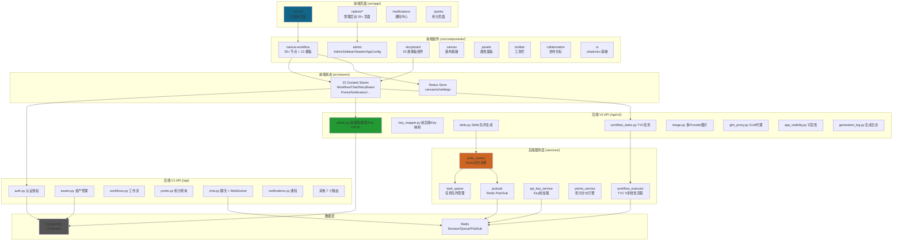

# NanoAiCanvas - 无限画布创作平台

> 基于 React Flow 的无限画布 Workflow 任务工作流系统，支持多 AI 服务集成

**项目版本**: 2.12.273
**最后更新**: 2026-05-14
**技术栈**: React 19.2.4 + TypeScript 5.9.3 + Vite 5.2.11 + FastAPI + PostgreSQL + Redis

---

## 变更记录 (Changelog)

### 2026-05-14 - 全面项目结构更新（v2.12.273）
- 版本从 2.4.1 大幅升级到 2.12.273
- 新增管理后台系统（25+ 页面）：用户/团队/积分/模型/渠道商/Key池/通知等
- 新增 Garden Skills 插件生态（4 skills：gpt-image-2, kb-retriever, web-design-engineer, web-video-presentation）
- 新增后端 V2 API：admin CRUD, key_mapper, generation_log, skills, workflow_tasks(TVC), app_visibility
- 新增后端服务层：workflow_executor, skills_worker, task_queue, api_key_service, pubsub
- 新增 Providers 系统统一 AI 服务调用（wuyinkeji, caohua_jimeng）
- 新增 Chat 系统：REST + WebSocket + Redis Pub/Sub 跨 Worker 消息分发
- 新增 15 个 Zustand Stores（从 7 个增长到 22 个）
- 新增 18 个自定义 Hooks
- 新增 40+ API 客户端模块
- 新增 7 个 Workflow 节点（TVC, Skills, Output 等）
- 新增 8 个后端数据模型
- 更新 12 个 Alembic 迁移版本
- **扫描覆盖率：100%（480+ 核心文件）**

### 2026-05-05 - 完整项目结构更新（含后端）
- 识别双仓库结构：前端（src/）+ 后端（backend/）
- 更新技术栈：React + FastAPI 全栈架构
- **扫描覆盖率：100%（200+ 核心文件）**

### 2026-04-22 - 完整 AI 上下文文档系统（深度扫描版）
- 完成全仓清点和模块结构分析
- **扫描覆盖率：100%（93+ 核心文件）**

---

## 项目愿景

**NanoAiCanvas** 是一个现代化的无限画布应用，专注于提供流畅的节点编辑体验。项目灵感来源于 Figma 的设计理念，采用 Base Nova 暗色主题，支持中英文国际化，并集成了强大的 AI 工作流功能。

### 核心特性

- **无限画布**: 基于 React Flow，支持平滑缩放、平移、小地图导航
- **55+ 节点类型**: 输入、AI 生成、决策、处理、输出、MiniMax、即梦、GLM、Qwen、Kimi、TVC、Skills 等
- **13+ 内置模板**: 故事板、角色设计、场景设计、快速分镜、TVC、Skills 等
- **管理后台**: 25+ 管理页面，用户/团队/积分/模型/渠道商全流程管理
- **Garden Skills**: 4 个 Skills 插件 + 90+ 参考模板
- **Chat 系统**: 实时聊天 + WebSocket + 文件上传 + Redis Pub/Sub
- **双重状态管理**: Redux Toolkit（全局）+ Zustand（Workflow/业务）
- **后端 V2 API**: 多 Provider 图片生成、Key 映射、TVC 工作流任务、Skills 队列
- **积分系统**: 自动计价引擎 + 余额校验 + 统计仪表盘
- **主题系统**: Base Nova 暗色主题 + OKLCH 颜色空间
- **国际化**: 完整的中英文切换支持
- **插件系统**: 支持自定义节点类型和 Skills 扩展

---

## 技术栈

### 前端（src/）

| 技术 | 版本 | 用途 |
|------|------|------|
| **React** | 19.2.4 | UI 框架 |
| **TypeScript** | 5.9.3 | 类型系统（严格模式） |
| **Vite** | 5.2.11 | 构建工具 |
| **Redux Toolkit** | 2.2.5 | 全局状态管理 |
| **Zustand** | latest | Workflow + 业务状态管理 |
| **React Flow** | 11.11.4 | 无限画布核心 |

### 后端（backend/）

| 技术 | 版本 | 用途 |
|------|------|------|
| **FastAPI** | 0.109.2 | Web 框架 |
| **SQLAlchemy** | 2.0.25 | ORM（async） |
| **PostgreSQL** | - | 主数据库 |
| **Redis** | 5.0.1 | Session/队列/Pub/Sub |
| **Pytest** | 8.0.0 | 测试框架 |

---

## 架构总览



---

## 模块结构图

```mermaid
graph TD
    A["NanoAiCanvas<br/>v2.12.273"] --> B["src/"]
    A --> BA["backend/"]
    A --> GS["garden-skills/"]

    B --> C["components/"]
    B --> D["stores/ (22)"]
    B --> E["store/ Redux"]
    B --> F["hooks/ (18)"]
    B --> G["lib/api/ (40+)"]
    B --> H["locales/"]
    B --> I["types/"]
    B --> J["app/ (页面路由)"]
    B --> K["styles/"]

    C --> C1["nanoai-workflow/"]
    C --> C2["admin/"]
    C --> C3["storyboard/"]
    C --> C4["canvas/"]
    C --> C5["panels/"]
    C --> C6["toolbar/"]
    C --> C7["collaboration/"]
    C --> C8["ui/"]
    C --> C9["edges/"]
    C --> C10["animations/"]
    C --> C11["accessibility/"]
    C --> C12["layout/"]
    C --> C13["timeline/"]
    C --> C14["nodes/"]
    C --> C15["HistoryPanelTabs/"]

    BA --> BA1["app/api/ (V1)"]
    BA --> BA2["app/api/v2/ (V2)"]
    BA --> BA3["app/models/ (16)"]
    BA --> BA4["app/services/"]
    BA --> BA5["app/providers/"]
    BA --> BA6["app/cli/"]
    BA --> BA7["app/core/"]
    BA --> BA8["alembic/"]

    GS --> GS1["gpt-image-2<br/>90+ 参考模板"]
    GS --> GS2["kb-retriever"]
    GS --> GS3["web-design-engineer"]
    GS --> GS4["web-video-presentation"]

    click C1 "./src/components/nanoai-workflow/CLAUDE.md" "Workflow 模块"
    click D "./src/stores/CLAUDE.md" "Zustand Stores"
    click E "./src/store/CLAUDE.md" "Redux Store"
    click C4 "./src/components/canvas/CLAUDE.md" "Canvas"
    click C5 "./src/components/panels/CLAUDE.md" "Panels"
    click F "./src/hooks/CLAUDE.md" "Hooks"
    click BA1 "./backend/app/api/CLAUDE.md" "Backend V1 API"
    click BA2 "./backend/app/api/v2/CLAUDE.md" "Backend V2 API"

    style A fill:#168,70%,45%
    style B fill:#168,80%,55%
    style BA fill:#293,80%,60%
    style GS fill:#c62,80%,55%
    style C1 fill:#293,90%,65%
```



---

## 模块索引

### 前端模块（src/）

| 模块 | 路径 | 职责 | 文档 |
|------|------|------|------|
| **NanoAI Workflow** | `src/components/nanoai-workflow` | AI 工作流核心，55+ 节点 + 13 模板 | [查看](./src/components/nanoai-workflow/CLAUDE.md) |
| **Admin 组件** | `src/components/admin` | 管理后台 UI 组件 | - |
| **Storyboard** | `src/components/storyboard` | 故事板面板，25 组件 | - |
| **Canvas** | `src/components/canvas` | 无限画布基础组件 | [查看](./src/components/canvas/CLAUDE.md) |
| **Panels** | `src/components/panels` | 属性面板和模板面板 | [查看](./src/components/panels/CLAUDE.md) |
| **Toolbar** | `src/components/toolbar` | 顶部工具栏 | - |
| **Collaboration** | `src/components/collaboration` | 协作光标 + 编辑冲突 | - |
| **UI Components** | `src/components/ui` | shadcn/ui 基础组件 | - |
| **Edges** | `src/components/edges` | 自定义边连线 | - |
| **Animations** | `src/components/animations` | 动画组件 | - |
| **Zustand Stores** | `src/stores` | 22 个业务状态管理 | [查看](./src/stores/CLAUDE.md) |
| **Redux Store** | `src/store` | 全局状态管理 | [查看](./src/store/CLAUDE.md) |
| **Hooks** | `src/hooks` | 18 个自定义 Hooks | [查看](./src/hooks/CLAUDE.md) |
| **Lib/API** | `src/lib/api` | 40+ API 客户端模块 | - |
| **Lib/DB** | `src/lib/db` | IndexedDB 本地存储 | - |
| **Lib/Sync** | `src/lib/sync` | 离线同步 | - |
| **Types** | `src/types` | TypeScript 类型定义 | - |
| **Locales** | `src/locales` | 国际化 zh-CN/en-US | - |
| **App Pages** | `src/app` | 页面路由（admin 25+ 页面） | - |

### 后端模块（backend/）

| 模块 | 路径 | 职责 | 文档 |
|------|------|------|------|
| **V1 API** | `backend/app/api/` | 核心业务 API（15 路由） | [查看](./backend/app/api/CLAUDE.md) |
| **V2 API** | `backend/app/api/v2/` | 新版 API（10 路由） | [查看](./backend/app/api/v2/CLAUDE.md) |
| **Services** | `backend/app/services/` | 业务服务层 | - |
| **Providers** | `backend/app/providers/` | AI 服务提供商 | - |
| **Models** | `backend/app/models/` | 16 个数据模型 | - |
| **Core** | `backend/app/core/` | 安全/配置工具 | - |
| **CLI** | `backend/app/cli/` | 命令行工具 | - |
| **Alembic** | `backend/alembic/` | 12 个数据库迁移 | - |

### Garden Skills 模块

| 模块 | 路径 | 职责 |
|------|------|------|
| **GPT-Image-2** | `garden-skills/skills/gpt-image-2/` | AI 图片生成 Skill，90+ 参考模板 |
| **KB-Retriever** | `garden-skills/skills/kb-retriever/` | 知识库检索 Skill |
| **Web-Design** | `garden-skills/skills/web-design-engineer/` | Web 设计工程 Skill |
| **Web-Video** | `garden-skills/skills/web-video-presentation/` | Web 视频演示 Skill |

---

## Workflow 工作流系统

### 节点类型（55+）

| 类别 | 节点类型 | 描述 |
|------|----------|------|
| **输入** | `input_text`, `input_image` | 文本/图片输入 |
| **AI 生成** | `script_generator`, `storyboard_generator`, `dialogue_generator`, `character_designer`, `scene_designer` | 故事板相关生成 |
| **TVC** | `tvc_script`, `storyboard_video`, `video_generator` | TVC 广告视频生成 |
| **故事板** | `storyboard_shot_a`, `storyboard_v2`, `storyboard_script_table`, `shot_ref_image` | 故事板分镜节点 |
| **Skills** | `skills_data`, `skills_task` | Skills 任务节点 |
| **MiniMax** | `minimax_text`, `minimax_speech`, `minimax_video`, `minimax_music`, `minimax_image`, `minimax_coding` | MiniMax 全套 AI |
| **图片生成** | `nano_banana_2`, `nano_banana_pro`, `gpt_image_2` | NanoBanana / GPT-Image |
| **即梦** | `jimeng_image`, `jimeng_video` | 字节 AI |
| **智谱 GLM** | `glm_text`, `glm_video`, `glm_tts`, `glm_multimodal` | 智谱 AI |
| **通义千问** | `qwen_text`, `qwen_coding` | 阿里 AI |
| **Kimi** | `kimi_text` | Moonshot AI |
| **预览** | `image_preview`, `video_preview`, `audio_preview`, `text_preview`, `output` | 结果预览/输出 |
| **其他** | `director_agent`, `screenwriter_agent`, `milestone`, `background_music`, `transition`, `connector` | 代理/工具节点 |

### 内置模板（13+）

1. **storyboard-01** - 故事板01（完整 9 步流程）
2. **character-workflow** - 角色设计工作流
3. **scene-workflow** - 场景设计工作流
4. **quick-storyboard-v2** - 快速分镜
5. **dual-line-character-design** - 双线角色设计
6. **storyboard-complete** - 完整故事板生成
7. **character-design** - 角色设计
8. **scene-design** - 场景设计
9. **storyboard-shot-a-workflow** - 故事板分镜V1版
10. **storyboard-v2-workflow** - 故事板分镜V2版
11. **skills-ui-mockups** - Skills: UI原型
12. **skills-product-visuals** - Skills: 产品视觉
13. **skills-maps** - Skills: 地图

---

## 后端 API 结构

### V1 API 路由（/api）

| 路由 | 文件 | 功能 |
|------|------|------|
| `/api/auth/*` | `auth.py` | 注册/登录/JWT/刷新 |
| `/api/assets/*` | `assets.py` | 资产管理 CRUD |
| `/api/workflows/*` | `workflows.py` | 工作流保存/加载 |
| `/api/points/*` | `points.py` | 积分查询/扣减 |
| `/api/points_admin/*` | `points_admin.py` | 积分管理后台 |
| `/api/categories/*` | `categories.py` | 自定义分类 |
| `/api/teams/*` | `teams.py` | 团队管理 |
| `/api/sync/*` | `sync.py` | 离线数据同步 |
| `/api/assets_export/*` | `assets_export.py` | 批量导出 |
| `/api/prompt_restrictions/*` | `prompt_restrictions.py` | 提示词限制 |
| `/api/admin_users/*` | `admin_users.py` | 用户管理后台 |
| `/api/notifications/*` | `notifications.py` | 通知推送 |
| `/api/tags/*` | `tags.py` | 标签管理 |
| `/api/folders/*` | `folders.py` | 文件夹管理 |
| `/chat/*` | `chat.py` | 即时聊天 + WebSocket |

### V2 API 路由（/api/v2）

| 路由 | 文件 | 功能 |
|------|------|------|
| `/api/v2/admin/*` | `admin.py` | 渠道商/模型/Key/用量 CRUD |
| `/api/v2/admin/key-mapper/*` | `key_mapper.py` | 前后端 API Key 映射 |
| `/api/v2/admin/app-visibility/*` | `app_visibility.py` | 应用可见性配置 |
| `/v2/image/*` | `image.py` | 多 Provider 图片生成 |
| `/api/v2/skills/*` | `skills.py` | Skills 队列式生成 |
| `/api/v2/tvc-tasks/*` | `workflow_tasks.py` | TVC 工作流任务 |
| `/api/v2/glm-proxy/*` | `glm_proxy.py` | GLM 提示词优化代理 |
| `/api/v2/minimax-proxy/*` | `minimax.py` | MiniMax 文本代理 |
| `/api/v2/generation-logs/*` | `generation_log.py` | 生成任务日志 |

### 后端服务层

| 服务 | 文件 | 描述 |
|------|------|------|
| **WorkflowExecutor** | `services/workflow_executor.py` | TVC 5 步线性流程执行器 |
| **SkillsWorker** | `services/skills_worker.py` | Redis 队列消费，步骤化图片生成 |
| **TaskQueue** | `services/task_queue.py` | 任务队列管理 |
| **ApiKeyService** | `services/api_key_service.py` | API Key 热加载（60s 缓存） |
| **PointsService** | `services/points_service.py` | 积分自动计价引擎 |
| **PubSub** | `services/pubsub.py` | Redis Pub/Sub 封装 |
| **HealthChecker** | `services/health_checker.py` | API Key 健康检查 |
| **ImageDownloader** | `services/image_downloader.py` | 图片下载服务 |
| **EmailService** | `services/email.py` | 邮件发送 |

### Providers（AI 服务提供商）

| Provider | 文件 | 描述 |
|----------|------|------|
| **Base** | `providers/base.py` | Provider 基类 + 工厂模式 |
| **Wuyinkeji** | `providers/wuyinkeji.py` | 速创 API（NanoBanana 系列） |
| **Caohua-Jimeng** | `providers/caohua_jimeng.py` | 即梦 API |

### 数据模型（16 个）

| 模型 | 文件 | 描述 |
|------|------|------|
| **User** | `models/user.py` | 用户（UUID, email, username） |
| **Asset** | `models/asset.py` | 资产（图片/视频/音频/文本） |
| **Workflow** | `models/workflow.py` | 工作流快照 |
| **Template** | `models/template.py` | 模板 |
| **Category** | `models/category.py` | 自定义分类 |
| **Team / PointsAccount / PointsTransaction** | `models/points.py` | 团队 + 积分账户 + 流水 |
| **ApiKey / ApiKeyConfig / BackendKeyMapping** | `models/api_key.py` | API Key 管理 + Key 映射 |
| **AppVisibility / VisibilityAuditLog** | `models/app_visibility.py` | 应用可见性 + 审计日志 |
| **Conversation / Message** | `models/conversation.py` | 聊天会话 + 消息 |
| **Folder** | `models/folder.py` | 文件夹 |
| **GenerationTaskLog** | `models/generation_log.py` | 生成任务日志 |
| **Notification** | `models/notification.py` | 通知 |
| **Operation** | `models/operation.py` | 操作日志 |
| **PromptRestriction** | `models/prompt_restrictions.py` | 提示词限制 |
| **Tag** | `models/tag.py` | 标签 |

---

## 开发指南

### 前端开发

```bash
pnpm install          # 安装依赖
pnpm dev              # 启动开发服务器
pnpm build            # 构建生产版本
pnpm lint             # 代码检查
pnpm test             # 运行测试
pnpm test:ui          # UI 模式测试
pnpm test:coverage    # 覆盖率
pnpm test:e2e         # E2E 测试
```

### 后端开发

```bash
cd backend
source venv/bin/activate
pip install -r requirements.txt
uvicorn app.main:app --reload --host 0.0.0.0 --port 8000
PYTHONPATH=. pytest tests/ -v
```

### 环境变量

**前端** (`.env`):
```
VITE_API_BASE_URL=http://localhost:8000
```

**后端** (`.env`):
```
POSTGRES_HOST=...
POSTGRES_PORT=5432
POSTGRES_DB=nanoai
POSTGRES_USER=...
POSTGRES_PASSWORD=...
REDIS_HOST=...
REDIS_PORT=6379
REDIS_PASSWORD=...
SECRET_KEY=...
```

---

## 测试策略

| 层级 | 工具 | 命令 |
|------|------|------|
| 前端单元 | Vitest | `pnpm test` |
| 前端覆盖率 | Vitest | `pnpm test:coverage` |
| E2E | Playwright | `pnpm test:e2e` |
| 后端单元 | Pytest | `PYTHONPATH=. pytest tests/ -v` |

---

## 目录管理规则

根目录只保留 `CLAUDE.md`、`README.md`、配置文件。所有文档存放在 `docs/`。

---

**文档维护**: 本文档应随项目更新同步维护
**最后更新**: 2026-05-14
**扫描覆盖率**: 100%（480+ 核心文件）
**生成者**: BB小子 🤙
