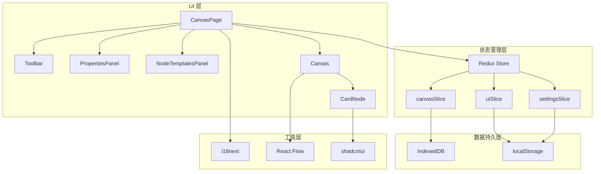
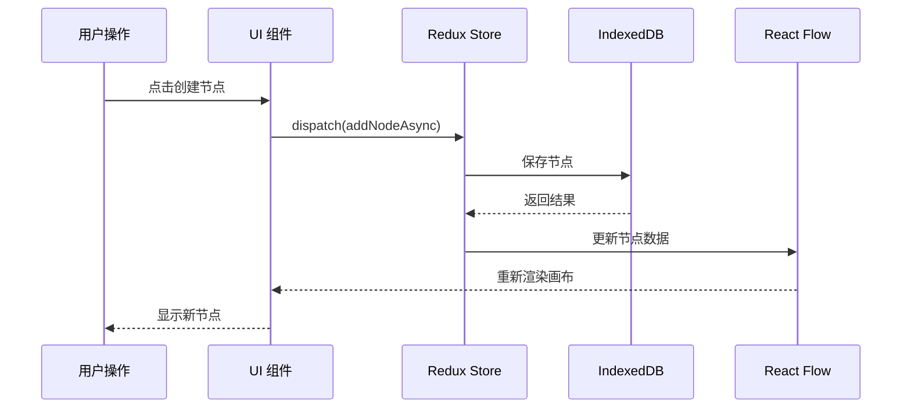

# NanoAiCanvas - 项目架构文档

> 基于 React Flow 的无限画布应用，支持卡片式节点和自由连线

**项目版本**: 0.1.0
**最后更新**: 2026-04-15
**技术栈**: React + TypeScript + Vite + shadcn/ui + Redux Toolkit + React Flow

---

## 📋 目录

- [项目愿景](#项目愿景)
- [技术栈](#技术栈)
- [架构总览](#架构总览)
- [模块结构](#模块结构)
- [核心功能](#核心功能)
- [开发指南](#开发指南)
- [测试策略](#测试策略)
- [部署方案](#部署方案)

---

## 项目愿景

**NanoAiCanvas** 是一个现代化的无限画布应用，专注于提供流畅的节点编辑体验。项目灵感来源于 Figma 的设计理念，采用 Base Nova 暗色主题，支持中英文国际化。

### 核心特性

- ✅ **无限画布**: 基于 React Flow，支持平滑缩放、平移
- ✅ **卡片节点**: 7 种预定义节点类型 + 自定义节点
- ✅ **自由连线**: 多种颜色、线型、动画效果
- ✅ **状态管理**: Redux Toolkit + IndexedDB 持久化
- ✅ **主题系统**: Base Nova 暗色主题 + OKLCH 颜色空间
- ✅ **国际化**: 完整的中英文切换支持
- ✅ **快捷键**: 全套键盘快捷键支持

---

## 技术栈

### 核心框架

| 技术 | 版本 | 用途 |
|------|------|------|
| **React** | 19.2.4 | UI 框架 |
| **TypeScript** | 5.9.3 | 类型系统（严格模式） |
| **Vite** | 5.2.11 | 构建工具 |
| **Redux Toolkit** | 2.2.5 | 状态管理 |

### UI 和样式

| 包名 | 用途 |
|------|------|
| **shadcn/ui** | 组件库（Base Nova 风格） |
| **Tailwind CSS** | 样式框架（OKLCH 颜色） |
| **Lucide React** | 图标库 |
| **React Flow** | 无限画布核心 |

### 数据和工具

| 包名 | 用途 |
|------|------|
| **idb** | IndexedDB 封装 |
| **i18next** | 国际化 |
| **sonner** | Toast 通知 |

---

## 架构总览

### 系统架构图



### 数据流向



---

## 模块结构

```
nanoai-canvas/
├── src/
│   ├── components/          # UI 组件
│   │   ├── canvas/          # 画布相关组件
│   │   │   ├── Canvas.tsx           # 主画布组件
│   │   │   ├── canvas.css           # 画布样式
│   │   │   └── nodes/
│   │   │       └── CardNode.tsx     # 卡片节点
│   │   ├── panels/          # 面板组件
│   │   │   ├── PropertiesPanel.tsx  # 属性面板
│   │   │   └── NodeTemplatesPanel.tsx # 模板面板
│   │   ├── toolbar/         # 工具栏
│   │   │   └── Toolbar.tsx
│   │   └── ui/              # shadcn/ui 组件
│   │       ├── button.tsx
│   │       ├── card.tsx
│   │       ├── input.tsx
│   │       └── ...
│   ├── store/               # Redux 状态管理
│   │   ├── slices/          # Redux 切片
│   │   │   ├── canvasSlice.ts       # 画布状态
│   │   │   ├── uiSlice.ts           # UI 状态
│   │   │   └── settingsSlice.ts     # 设置状态
│   │   ├── store.ts         # Store 配置
│   │   ├── hooks.ts         # 类型化 hooks
│   │   └── db.ts            # IndexedDB 操作
│   ├── hooks/               # 自定义 Hooks
│   │   ├── useAutosave.ts   # 自动保存
│   │   ├── useShortcuts.ts  # 快捷键
│   │   └── useI18n.ts       # 国际化
│   ├── lib/                 # 工具库
│   │   ├── utils.ts         # 通用工具函数
│   │   └── i18n.ts          # i18next 配置
│   ├── locales/             # 国际化文件
│   │   ├── zh-CN/           # 中文
│   │   └── en-US/           # 英文
│   ├── types/               # TypeScript 类型
│   │   └── index.ts
│   ├── styles/              # 全局样式
│   │   └── globals.css      # 主题和全局样式
│   ├── pages/               # 页面组件
│   │   └── CanvasPage.tsx
│   ├── test/                # 测试配置
│   │   └── setup.ts
│   ├── App.tsx              # 根组件
│   └── main.tsx             # 入口文件
├── public/                  # 静态资源
├── e2e/                     # E2E 测试
├── .github/                 # GitHub Actions
├── package.json
├── vite.config.ts
├── tsconfig.json
├── tailwind.config.ts
├── vitest.config.ts
├── playwright.config.ts
└── components.json          # shadcn/ui 配置
```

---

## 核心功能

### 1. 无限画布（Canvas）

基于 React Flow 实现，支持：
- 平滑缩放和平移
- 网格背景和吸附
- 小地图导航
- 节点拖拽和连接

**关键文件**: `src/components/canvas/Canvas.tsx`

### 2. 节点系统

支持 7 种预定义节点类型：
- 任务（Task）
- 事件（Event）
- 里程碑（Milestone）
- 决策（Decision）
- 数据（Data）
- 开始（Start）
- 结束（End）

**关键文件**: `src/components/canvas/nodes/CardNode.tsx`

### 3. 状态管理

使用 Redux Toolkit 管理 3 个主要状态：
- **canvasSlice**: 节点和连线数据
- **uiSlice**: UI 交互状态
- **settingsSlice**: 应用设置

**关键文件**: `src/store/slices/`

### 4. 数据持久化

使用 IndexedDB 存储大量数据，localStorage 存储设置：
- 自动保存机制
- 导入/导出功能
- 历史版本记录

**关键文件**: `src/store/db.ts`

---

## 开发指南

### 环境要求

- Node.js >= 18.0.0
- npm >= 9.0.0

### 快速开始

```bash
# 安装依赖
npm install

# 启动开发服务器
npm run dev

# 构建生产版本
npm run build

# 预览生产版本
npm run preview
```

### 开发工具

```bash
# 代码检查
npm run lint

# 代码格式化
npm run format

# 类型检查
npm run type-check

# 运行测试
npm run test
```

### 添加新的节点类型

1. 在 `src/types/index.ts` 中添加新的 `NodeType`
2. 在 `src/components/canvas/nodes/` 中创建新节点组件
3. 在 `src/components/panels/NodeTemplatesPanel.tsx` 中添加模板
4. 在国际化文件中添加翻译

### 主题定制

主题使用 OKLCH 颜色空间，配置在 `src/styles/globals.css` 中：

```css
:root {
  --primary: 168 70% 45%; /* 青绿色 */
  --accent: 168 80% 55%;  /* 亮青绿 */
  /* ... 其他颜色 */
}
```

---

## 测试策略

### 单元测试

使用 Vitest + Testing Library：

```bash
# 运行测试
npm run test

# 测试 UI 模式
npm run test:ui
```

### E2E 测试

使用 Playwright：

```bash
# 安装浏览器
npx playwright install

# 运行 E2E 测试
npm run test:e2e
```

### 测试覆盖率

目标覆盖率：**80%+**

---

## 部署方案

### Vercel 部署

项目配置了 Vercel 自动部署：

```bash
# 推送到 main 分支触发部署
git push origin main
```

### Docker 部署

```bash
# 构建镜像
docker build -t nanoai-canvas .

# 运行容器
docker run -p 80:80 nanoai-canvas
```

### 环境变量

参考 `.env.example` 配置环境变量。

---

## 相关文档

- [React Flow 文档](https://reactflow.dev/)
- [Redux Toolkit 文档](https://redux-toolkit.js.org/)
- [shadcn/ui 文档](https://ui.shadcn.com/)
- [Tailwind CSS 文档](https://tailwindcss.com/)

---

**文档维护**: 本文档应随项目更新同步维护
**最后更新**: 2026-04-15
