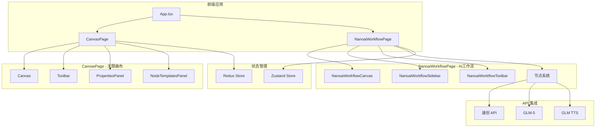

# NanoAI Canvas Storyboard - 项目说明

> **项目名称**: NanoAiCanvas Storyboard  
> **版本**: 2.2.1  
> **最后更新**: 2026-04-20  
> **类型**: AI 驱动的无限画布 + 工作流编辑器

---

## 🎯 项目简介

NanoAiCanvas Storyboard 是一个基于 React Flow 的无限画布应用，集成了 AI 驱动的工作流编辑器。用户可以通过拖拽节点、设置参数、连接流程来构建强大的 AI 生成工作流，实现从文案到可视化故事板的一键生成。

### 核心特性

#### 1. **双模式系统**
- 🎨 **无限画布模式** - 自由节点编辑，基于 Redux Toolkit
- 🤖 **AI 工作流模式** - 可视化工作流，基于 Zustand

#### 2. **AI 集成**
- 📝 **GLM-5** - 脚本生成
- 🎨 **速创 API** - 图像生成
- 🔊 **GLM TTS** - 语音合成

#### 3. **主题系统**
- ☀️ **浅色主题** - 清爽明亮
- 🌙 **深色主题** - 赛博朋克风格，炫酷动感

#### 4. **高级功能**
- 💾 **模板系统** - 保存和加载工作流模板
- 📚 **版本管理** - 工作流版本快照和恢复
- 📤 **导入导出** - JSON 格式工作流
- 🔍 **实时搜索** - 节点快速查找

---

## 🏗️ 技术架构

### 技术栈

| 类别 | 技术 | 版本 | 用途 |
|------|------|------|------|
| **框架** | React | 19.2.4 | UI 框架 |
| **语言** | TypeScript | 5.9.3 | 类型系统 |
| **构建** | Vite | 5.2.11 | 构建工具 |
| **画布** | React Flow | 最新 | 无限画布核心 |
| **状态管理** | Redux Toolkit | 2.2.5 | 主画布状态 |
| **状态管理** | Zustand | 最新 | 工作流状态 |
| **UI 组件** | shadcn/ui | 最新 | 组件库 |
| **样式** | Tailwind CSS | 最新 | 样式框架 |
| **国际化** | i18next | 最新 | 中英文切换 |
| **图标** | Lucide React | 最新 | 图标库 |

### 架构设计



---

## 📁 项目结构

```
NanoAiCanvas_Storyboard/
├── src/
│   ├── components/
│   │   ├── canvas/                    # 无限画布组件
│   │   │   ├── Canvas.tsx
│   │   │   ├── nodes/
│   │   │   └── ...
│   │   ├── nanoai-workflow/          # AI 工作流组件
│   │   │   ├── NanoaiWorkflowCanvas.tsx
│   │   │   ├── NanoaiWorkflowSidebar.tsx
│   │   │   ├── NanoaiWorkflowToolbar.tsx
│   │   │   ├── nodes/                 # 工作流节点
│   │   │   │   ├── BaseNode.tsx
│   │   │   │   ├── ScriptGeneratorNode.tsx
│   │   │   │   ├── StoryboardGeneratorNode.tsx
│   │   │   │   ├── DialogueGeneratorNode.tsx
│   │   │   │   ├── CharacterDesignerNode.tsx
│   │   │   │   └── SceneDesignerNode.tsx
│   │   │   └── ui/                    # UI 组件
│   │   │       ├── Theme.tsx
│   │   │       ├── EmptyState.tsx
│   │   │       ├── UIComponents.tsx
│   │   │       └── Progress.tsx
│   │   ├── panels/                    # 面板组件
│   │   ├── toolbar/                   # 工具栏组件
│   │   └── ui/                        # shadcn/ui 组件
│   ├── stores/
│   │   ├── slices/                    # Redux slices
│   │   └── nanoaiWorkflowStore.ts     # Zustand store
│   ├── lib/
│   │   └── api/
│   │       └── suchuang-api.ts        # 速创 API
│   ├── pages/
│   │   ├── CanvasPage.tsx
│   │   └── NanoaiWorkflowPage.tsx
│   ├── styles/
│   │   ├── globals.css
│   │   └── dark-theme.css            # 深色主题
│   ├── hooks/                         # 自定义 hooks
│   ├── locales/                       # 国际化
│   └── types/                         # TypeScript 类型
├── public/                            # 静态资源
├── docs/                              # 文档
└── Storyboard/                        # 参考实现

```

---

## 🚀 快速开始

### 环境要求

- Node.js >= 18.0.0
- pnpm >= 8.0.0

### 安装和运行

```bash
# 克隆项目
git clone <repository-url>
cd NanoAiCanvas_Storyboard

# 安装依赖
pnpm install

# 启动开发服务器
pnpm run dev

# 构建生产版本
pnpm run build

# 预览生产版本
pnpm run preview
```

### 访问应用

- **开发服务器**: http://localhost:3001/
- **网络访问**: http://192.168.1.100:3001/

---

## 📖 使用文档

### 核心文档

1. **[完整功能总结](./NANOWORKFLOW_COMPLETION_SUMMARY.md)**
   - 详细的功能列表
   - 技术实现说明
   - 性能指标
   - 最佳实践

2. **[快速开始指南](./QUICK_START_GUIDE.md)**
   - 5分钟快速上手
   - 常用操作教程
   - 快捷键说明
   - 常见问题解答

3. **[项目架构文档](./CLAUDE.md)**
   - 系统架构设计
   - 模块说明
   - 集成策略
   - 开发指南

### UI/UX 文档

1. **[UI/UX 优化总结](./.claude/ui-ux-phase2-summary.md)**
   - 第二阶段优化内容
   - 新增组件总览
   - 动画增强
   - 响应式优化

2. **[深色主题样式](./src/styles/dark-theme.css)**
   - 赛博朋克风格
   - CSS 变量定义
   - 动画效果

---

## 🎨 设计系统

### 主题配色

#### 浅色主题
```css
主色调: 青绿色 (#168)
--primary: 168 70% 45%;
--accent: 168 80% 55%;
```

#### 深色主题（赛博朋克）
```css
主背景: #0a0a0f
次背景: #1a1a2e
主紫色: #a855f7
主粉色: #ec4899
霓虹紫: #c084fc
霓虹粉: #f472b6
```

### 紫粉渐变系统

```css
/* 按钮 */
from-purple-500 to-pink-500

/* 文字 */
from-purple-600 to-pink-600

/* 背景 */
from-purple-50 to-pink-50 (浅色)
from-purple-900/40 to-pink-900/40 (深色)
```

---

## 🔌 API 集成

### 速创 API

**配置：**
```typescript
const SUCHUANG_API_CONFIG = {
  baseURL: 'https://api.wuyinkeji.com/v1',
  apiKey: 'dM2Gez6cbTHkRaKdoki5NBN3qc'
};
```

**功能：**
- 图片生成（自动轮询）
- Prompt 构建（分镜/角色/场景）
- 进度回调

---

## 🧪 测试

### 单元测试

```bash
# 运行测试
pnpm test

# 测试覆盖率
pnpm test:coverage

# UI 模式
pnpm test:ui
```

### E2E 测试

```bash
# 安装浏览器
npx playwright install

# 运行 E2E 测试
pnpm test:e2e
```

---

## 📊 性能优化

### 已实施优化

1. **组件优化**
   - React.memo 防止不必要渲染
   - useCallback 稳定函数引用
   - useMemo 缓存计算结果
   - Lazy loading 按需加载

2. **动画优化**
   - CSS 硬件加速（transform）
   - GPU 加速（translate3d）
   - will-change 提示
   - 合理的动画时长

3. **状态管理优化**
   - Zustand persist 中间件
   - Redux Toolkit 不可变更新
   - 选择器优化

### 性能指标

- **首次加载**: < 2s
- **节点添加**: < 100ms
- **连线创建**: < 50ms
- **动画帧率**: 60 FPS

---

## 🌟 特性亮点

### 1. 赛博朋克深色主题 ⭐⭐⭐⭐⭐

- 🌊 连线流动动画（1s 线性循环）
- 💜 节点呼吸效果（2s 缓动循环）
- 🌐 动态网格背景（20s 移动）
- 🎆 霓虹发光按钮
- 🪟 玻璃态面板

### 2. 实时响应模式 ⭐⭐⭐⭐⭐

- 800ms 防抖自动执行
- 参数变更即时响应
- 无需手动点击执行

### 3. 智能端口系统 ⭐⭐⭐⭐

- 类型检查（5种类型）
- 自动颜色编码
- 悬停显示详细信息
- 连接自动匹配

### 4. 模板系统 ⭐⭐⭐⭐

- 4个内置模板
- 自定义模板
- 一键加载
- 分类管理

### 5. 版本管理 ⭐⭐⭐⭐

- 自动版本快照
- 最多保存10个版本
- 一键恢复
- 版本描述记录

---

## 🛠️ 开发指南

### 添加新的节点类型

1. 在 `WorkflowNodeType` 枚举中添加新类型
2. 创建新的节点组件（继承 `BaseNode`）
3. 在 `nodes/index.ts` 中导出
4. 在侧边栏中添加节点配置

### 添加新的主题颜色

1. 编辑 `src/styles/dark-theme.css`
2. 添加 CSS 变量
3. 在组件中使用 Tailwind 类名

### 集成新的 API

1. 在 `src/lib/api/` 中创建 API 文件
2. 实现轮询机制
3. 在节点中调用 API
4. 处理进度和错误

---

## 🐛 已知问题

### 待修复

- [ ] Delete 键删除节点功能
- [ ] 撤销/重做功能
- [ ] 多选节点功能
- [ ] 节点复制粘贴快捷键

### 已知限制

- 移动端触控支持待优化
- 大型工作流性能待测试
- 并发执行限制

---

## 🚀 未来规划

### P0 - 立即执行

1. 完善 Delete 键功能
2. 添加撤销/重做
3. 实现多选节点

### P1 - 本周完成

1. 工作流分享功能
2. 导出为图片/PDF
3. 协作编辑功能

### P2 - 后续优化

1. AI 智能推荐节点连接
2. 工作流模板市场
3. 节点性能监控面板
4. 移动端完整支持

---

## 📝 更新日志

### Version 2.2.1 (2026-04-20)

#### 新增
- ✨ AI 工作流系统
- ✨ 5种AI节点类型
- ✨ 赛博朋克深色主题
- ✨ 模板系统（4个内置模板）
- ✨ 版本管理功能
- ✨ 实时响应模式（800ms防抖）
- ✨ 页面切换功能

#### 优化
- 🎨 UI/UX 全面优化
- 🌊 连线流动动画
- 💜 节点呼吸效果
- 🪟 玻璃态面板
- ⚡ 性能优化

#### 修复
- 🐛 主题切换状态保持
- 🐛 深色主题组件适配
- 🐛 移动端响应式布局

---

## 👥 贡献指南

欢迎提交 Issue 和 Pull Request！

### 开发规范

1. 遵循 ESLint 和 Prettier 配置
2. 使用 TypeScript 严格模式
3. 组件使用函数式组件 + Hooks
4. 编写单元测试
5. 更新相关文档

### Commit 规范

```
feat: 新功能
fix: 修复bug
docs: 文档更新
style: 代码格式调整
refactor: 重构代码
perf: 性能优化
test: 测试相关
chore: 构建/工具链相关
```

---

## 📄 许可证

MIT License

---

## 👤 联系方式

- **维护者**: BB小子 🤙
- **项目**: NanoAiCanvas Storyboard
- **邮箱**: [待填写]

---

**Be water, my friend! 🤙**

_最后更新: 2026-04-20_
