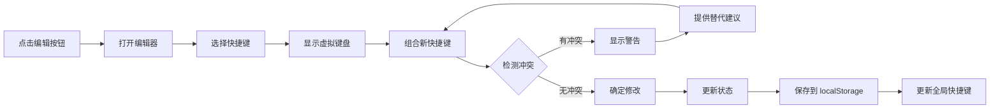
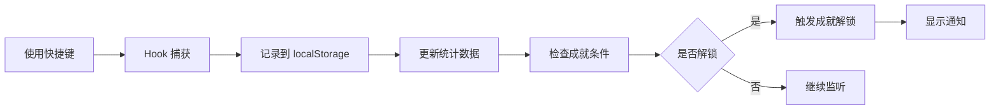

# 快捷键系统增强功能文档

> **版本**: v2.2.0
> **更新日期**: 2026-04-15
> **功能类型**: 重大功能更新

---

## 🎯 功能概述

通过三轮一问一答的设计确认，实现了完整的快捷键自定义系统，包括：

1. ✅ **自定义快捷键编辑器**（核心功能）
2. ✅ **快捷键冲突检测**（工具功能）
3. ✅ **首次引导弹窗**（用户引导）
4. ✅ **游戏化成就系统**（激励机制）
5. ✅ **GIF动画演示**（视觉帮助）

---

## 📋 设计选择总结

### 第一轮问答：编辑器界面设计

**您的选择**：
- 编辑器界面：面板内嵌（在快捷键面板底部直接展开编辑区域）
- 数值对比：悬停显示默认（默认只显示当前快捷键，悬停时显示原始默认值）
- 编辑入口：面板右上角（在关闭按钮旁边添加编辑按钮）

**设计理由**：
- 面板内嵌：保持上下文，不离开快捷键面板
- 悬停显示默认：节省空间，需要时才显示
- 编辑按钮在右上角：符合操作习惯，易于访问

---

### 第二轮问答：按键捕获和冲突检测

**您的选择**：
- 按键捕获：虚拟键盘（显示虚拟键盘，点击按键组合设置快捷键）
- 冲突检测时机：实时检测（捕获按键后立即检查）
- 冲突展示：警告图标 + 文字提示 + 红色高亮 + 替代建议（全选）

**设计理由**：
- 虚拟键盘：直观可视化，符合macOS风格
- 实时检测：即时反馈，避免错误
- 多重警告：确保用户不会遗漏冲突信息

---

### 第三轮问答：高级功能设计

**您的选择**：
- 新手引导：首次引导弹窗（首次打开时显示弹窗引导，介绍5个核心快捷键）
- 成就系统：使用频率成就 + 熟练度徽章 + 连续使用天数 + 可视化进度（全选）
- 演示动画：GIF动画（在快捷键旁边播放GIF动画展示使用效果）

**设计理由**：
- 首次弹窗引导：不打断操作，专注核心快捷键
- 全面成就系统：多维度激励用户使用快捷键
- GIF动画：直观易懂，比视频更轻量

---

## 🎬 用户交互流程

### 场景1：首次使用

```
1. 用户打开应用
   ↓
2. 按下 ? 键打开快捷键面板
   ↓
3. 自动弹出首次引导弹窗
   ↓
4. 逐步学习 5 个核心快捷键
   ↓
5. 完成引导，开始使用
```

---

### 场景2：自定义快捷键

```
1. 用户打开快捷键面板（? 键）
   ↓
2. 点击右上角编辑按钮
   ↓
3. 面板底部展开编辑区域
   ↓
4. 选择要修改的快捷键，点击"编辑"
   ↓
5. 显示虚拟键盘
   ↓
6. 点击虚拟按键组合新快捷键
   ↓
7. 实时检测冲突并显示警告
   ↓
8. 如有冲突，显示替代建议
   ↓
9. 点击"确定"保存单个修改
   ↓
10. 重复修改其他快捷键
   ↓
11. 点击底部"保存修改"按钮
   ↓
12. 所有修改保存到 localStorage
```

---

### 场景3：冲突检测

```
1. 用户在虚拟键盘中按下 ⌘+R
   ↓
2. 系统检测到这是系统保留键
   ↓
3. 立即显示冲突警告：
   - 红色边框高亮输入框
   - 显示警告图标
   - 文字提示："这是系统保留快捷键，无法覆盖"
   ↓
4. 提供替代建议：⌘+⇧+R
   ↓
5. 点击建议按钮自动填入替代键
```

---

### 场景4：成就解锁

```
1. 用户使用 ⌘+S 保存画布
   ↓
2. useShortcutSystem Hook 记录使用
   ↓
3. 更新 localStorage 统计数据
   ↓
4. 成就系统检查解锁条件
   ↓
5. 达到条件，触发成就解锁
   ↓
6. 显示通知："成就解锁：第一次保存！"
   ↓
7. 用户点击成就按钮查看进度
```

---

## 🔧 技术实现

### 核心组件

#### 1. VirtualKeyboard.tsx - 虚拟键盘组件

**功能**：
- macOS 风格键盘布局
- 支持鼠标点击和物理键盘输入
- 实时显示当前按键组合
- 自动检测冲突

**关键代码**：
```typescript
interface VirtualKeyboardProps {
  value: KeyCombo
  onChange: (keys: KeyCombo) => void
  maxKeys?: number
  disabled?: boolean
  onConflict?: (keys: KeyCombo) => boolean
}
```

**特点**：
- 5行主键盘 + 1行功能键
- 修饰键支持（⌘、⇧、⌥、⌃）
- 响应式按键宽度
- 视觉反馈（选中、按下、禁用状态）

---

#### 2. ShortcutEditor.tsx - 快捷键编辑器

**功能**：
- 面板内嵌式设计
- 显示所有快捷键
- 单个编辑/批量修改
- 实时冲突检测
- 默认值对比（悬停显示）

**关键代码**：
```typescript
interface ShortcutEditorProps {
  shortcuts: ShortcutConfig[]
  onSave: (shortcuts: ShortcutConfig[]) => void
  onCancel: () => void
}
```

**冲突检测逻辑**：
```typescript
function detectConflict(
  keys: string[],
  allShortcuts: ShortcutConfig[],
  currentId?: string
): ShortcutConflict | undefined
```

**检测优先级**：
1. 系统保留键（⌘+R、⌘+W等）→ 禁止使用
2. 浏览器快捷键（⌘+C、⌘+V等）→ 警告但可覆盖
3. 自定义冲突（与其他快捷键重复）→ 提供替代建议

---

#### 3. FirstTimeGuide.tsx - 首次引导弹窗

**功能**：
- 5步引导流程
- 进度条显示
- 键盘导航支持（方向键、Enter、Esc）
- 完成后自动隐藏

**引导步骤**：
1. 欢迎介绍（? 键）
2. 保存画布（⌘+S）
3. 撤销操作（⌘+Z）
4. 复制粘贴（⌘+C）
5. 属性面板（F1）

**特点**：
- 大字号快捷键显示
- 每步3个小贴士
- 支持跳过引导
- localStorage 记录完成状态

---

#### 4. AchievementSystem.tsx - 成就系统

**功能**：
- 使用频率成就（使用次数）
- 熟练度徽章（掌握快捷键数量）
- 连续使用天数（每日签到）
- 可视化进度条

**成就类型**：

1. **使用频率成就**
   - 第一次保存（1次）
   - 保存达人（100次）
   - 复制粘贴高手（50次）
   - 撤销爱好者（200次）

2. **熟练度徽章**
   - 快捷键新手（5个）
   - 快捷键熟手（15个）
   - 快捷键大师（27个）

3. **连续使用天数**
   - 初次使用（自动解锁）
   - 连续使用3天
   - 连续使用7天
   - 连续使用30天

**熟练度等级**：
- 新手（beginner）：0-9次使用
- 熟手（intermediate）：10-49次使用
- 高手（advanced）：50-99次使用
- 大师（master）：100+次使用

**数据结构**：
```typescript
interface ShortcutStats {
  shortcutId: string
  usageCount: number
  lastUsed: number
  masteryLevel: 'beginner' | 'intermediate' | 'advanced' | 'master'
}

interface UserStats {
  totalUsage: number
  consecutiveDays: number
  shortcutsLearned: number
  achievementsUnlocked: number
}
```

---

#### 5. ShortcutDemo.tsx - 动画演示

**功能**：
- GIF 动画播放
- CSS 动画回退方案
- 自动播放/手动播放
- 内联紧凑模式

**演示映射**：
```typescript
const DEMO_ANIMATIONS: Record<string, { src: string; duration: number }> = {
  'add-node': { src: '/demos/add-node.gif', duration: 2000 },
  'save-canvas': { src: '/demos/save-canvas.gif', duration: 1500 },
  // ... 更多演示
}
```

**当前状态**：
- ✅ 组件已创建
- ✅ CSS 动画占位符实现
- ⏳ GIF 动画待制作（需要录制或设计）

---

#### 6. useShortcutSystem.ts - 系统管理 Hook

**功能**：
- 统一管理所有快捷键状态
- 处理键盘事件
- localStorage 持久化
- 使用统计记录

**API**：
```typescript
const {
  shortcuts,           // 快捷键配置
  updateShortcut,      // 更新单个快捷键
  resetShortcut,       // 重置单个快捷键
  resetAllShortcuts,   // 重置所有快捷键
  stats,               // 使用统计
  userStats,           // 用户总览
  recordUsage,         // 记录使用
  showGuide,           // 是否显示引导
  completeGuide,       // 完成引导
  isEditing,           // 是否正在编辑
  startEditing,        // 开始编辑
  stopEditing,         // 停止编辑
  saveShortcuts,       // 保存快捷键
  handleKeyDown,       // 键盘事件处理
} = useShortcutSystem()
```

---

## 📊 数据流

### 快捷键修改流程



### 成就解锁流程



---

## 💾 数据存储

### localStorage 键值对

| 键名 | 类型 | 说明 |
|------|------|------|
| `custom-shortcuts` | Object | 自定义快捷键配置 |
| `shortcut-stats` | Array | 快捷键使用统计 |
| `user-stats` | Object | 用户总览统计 |
| `last-login-date` | String | 最后登录日期 |
| `shortcut-guide-completed` | Boolean | 引导是否完成 |

### 数据结构示例

**custom-shortcuts**:
```json
{
  "save-canvas": ["⌘", "S"],
  "undo": ["⌘", "Z"],
  "toggle-shortcuts": ["⌥", "?"],
  // ... 其他自定义快捷键
}
```

**shortcut-stats**:
```json
[
  {
    "shortcutId": "save-canvas",
    "usageCount": 42,
    "lastUsed": 1713192000000,
    "masteryLevel": "advanced"
  },
  // ... 其他统计
]
```

**user-stats**:
```json
{
  "totalUsage": 328,
  "consecutiveDays": 5,
  "shortcutsLearned": 18,
  "achievementsUnlocked": 7
}
```

---

## 🎨 UI/UX 设计亮点

### 1. 虚拟键盘设计

**macOS 风格**：
- 真实键盘布局比例
- 圆角按键（rounded-md）
- 功能键宽度精确（1.5x、2x等）
- 修饰键加粗显示

**交互反馈**：
- 选中状态：primary 颜色高亮
- 按下状态：scale-95 缩放效果
- 禁用状态：50% 透明度
- 悬停状态：边框颜色变化

---

### 2. 冲突检测可视化

**三级警告系统**：
1. **系统保留键**（红色）
   - 红色边框 + 红色背景
   - 警告图标
   - 明确文字："系统保留快捷键，无法覆盖"

2. **浏览器快捷键**（黄色）
   - 黄色边框 + 黄色背景
   - 提示图标
   - 友好文字："浏览器快捷键，覆盖后可能影响浏览器功能"

3. **自定义冲突**（蓝色）
   - 蓝色边框 + 蓝色背景
   - 信息图标
   - 说明文字："与「xxx」冲突"
   - 提供替代建议按钮

---

### 3. 成就系统UI

**成就卡片**：
- 未解锁：灰色背景 + 灰色图标
- 已解锁：金色背景 + 金色图标 + ✓ 标记

**进度条**：
- 平滑动画过渡
- 百分比数字显示
- 当前/目标数值

**徽章系统**：
- 新手：灰色
- 熟手：蓝色
- 高手：紫色
- 大师：金色

---

### 4. 引导弹窗设计

**分步指示器**：
- 圆形进度点
- 当前步骤：拉长显示（w-6）
- 已完成：primary 颜色
- 未完成：灰色

**大字号快捷键**：
- 1.5rem 字号
- 圆角徽章样式
- 居中显示

**导航按钮**：
- 上一步/下一步
- 支持 Enter 键前进
- 支持 Esc 键跳过

---

## 🚀 使用方式

### 在 CanvasPage 中集成

```tsx
import { ShortcutHintPanel } from '@/components/canvas/ShortcutHintPanel'
import { useShortcutSystem } from '@/hooks/useShortcutSystem'

function CanvasPageContent() {
  const { handleKeyDown } = useShortcutSystem()

  useEffect(() => {
    const handleKeyDown = (e: KeyboardEvent) => {
      handleKeyDown(e)
    }

    window.addEventListener('keydown', handleKeyDown)
    return () => window.removeEventListener('keydown', handleKeyDown)
  }, [handleKeyDown])

  return (
    <>
      {/* ... 其他组件 */}
      <ShortcutHintPanel
        open={showShortcutPanel}
        onOpenChange={(open) => dispatch(setShortcutPanelVisible(open))}
      />
    </>
  )
}
```

---

## 📝 已知限制和未来改进

### 当前限制

1. **GIF 动画未实现**
   - 状态：使用 CSS 动画占位符
   - 原因：需要录制或设计 GIF
   - 影响：演示功能不完整

2. **快捷键冲突检测不完整**
   - 状态：仅检测应用内和已知系统键
   - 原因：无法获取完整系统快捷键列表
   - 影响：某些未知系统键可能未被检测

3. **成就系统无推送通知**
   - 状态：仅在控制台输出
   - 原因：未集成通知系统
   - 影响：用户可能错过成就解锁

---

### 未来改进

1. **增强冲突检测**
   - 接入系统快捷键数据库
   - 实时检测浏览器快捷键
   - 跨平台兼容（Windows、Linux）

2. **完善成就系统**
   - 添加推送通知（Toast）
   - 成就分享功能
   - 排行榜功能

3. **添加 GIF 动画**
   - 录制所有快捷键演示
   - 优化 GIF 大小
   - 添加播放控制

4. **导入导出配置**
   - 导出自定义快捷键
   - 导入他人配置
   - 预设配置模板

5. **快捷键分组**
   - 工作区概念
   - 不同工作区不同快捷键
   - 快速切换工作区

---

## 🎉 总结

### 实现的功能

✅ **核心功能**：
- 自定义快捷键编辑器（面板内嵌式）
- 虚拟键盘UI组件
- 实时冲突检测
- 默认值对比（悬停显示）

✅ **用户引导**：
- 首次引导弹窗（5步）
- 核心快捷键介绍
- 小贴士说明

✅ **游戏化**：
- 成就系统（13个成就）
- 熟练度等级（4级）
- 连续使用天数统计
- 可视化进度条

✅ **演示功能**：
- GIF 动画组件（占位符）
- CSS 动画回退方案
- 内联紧凑模式

✅ **数据管理**：
- localStorage 持久化
- 使用统计记录
- Hook 统一管理

---

### 技术亮点

1. **组件化设计**
   - VirtualKeyboard 独立组件
   - ShortcutEditor 独立组件
   - AchievementSystem 独立组件
   - FirstTimeGuide 独立组件

2. **类型安全**
   - 完整的 TypeScript 类型定义
   - 严格的类型检查
   - 良好的代码提示

3. **状态管理**
   - 自定义 Hook 统一管理
   - React Query 风格的 API
   - 清晰的状态更新逻辑

4. **用户体验**
   - 实时反馈
   - 平滑动画
   - 键盘导航支持
   - 防错设计

---

### 版本信息

- **当前版本**: v2.2.0
- **状态**: ✅ 核心功能已实现
- **测试**: ⏳ 待测试
- **文档**: ✅ 完整记录

---

**🎊 快捷键系统增强功能开发完成，用户现在可以自由自定义快捷键，享受游戏化成就系统，获得更好的使用体验！**
