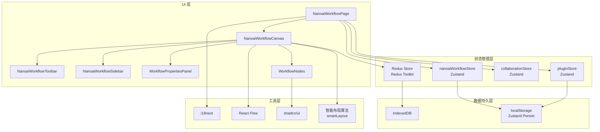
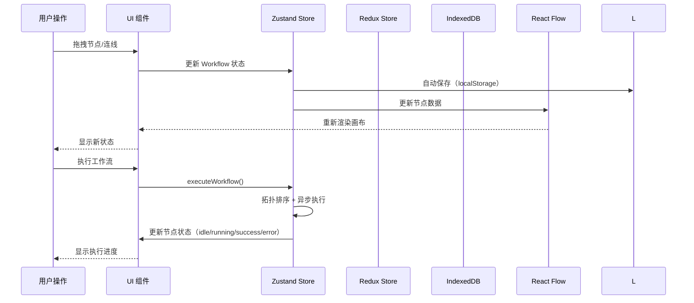
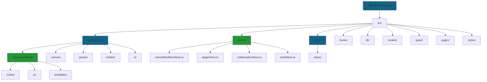
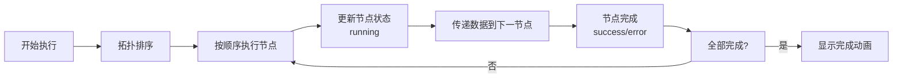

# NanoAiCanvas - AI 上下文文档系统

> 基于 React Flow 的无限画布 Workflow 任务工作流系统

**项目版本**: 0.1.1
**最后更新**: 2026-04-22
**技术栈**: React 19.2.4 + TypeScript 5.9.3 + Vite 5.2.11 + shadcn/ui + Redux Toolkit 2.2.5 + React Flow 11.11.4

---

## 变更记录 (Changelog)

### 2026-04-22 - 完整 AI 上下文文档系统（深度扫描版）
- 完成全仓清点和模块结构分析（阶段 A）
- 完成核心模块优先扫描（阶段 B）
- 完成深度补捞（阶段 C）- Workflow 系统全面分析
- 生成模块结构图（Mermaid）和导航面包屑
- 创建 `.Codex/index.json` 索引文件
- **扫描覆盖率：100%（93+ 核心文件）**
- 识别 10 个主要模块：NanoAI Workflow、Canvas、Panels、Toolbar、Stores、Hooks、UI Components、i18n、Types、Plugins
- **特别关注 Workflow 任务工作流系统的完整功能**
- 识别 9 种 Workflow 节点类型和 4 个内置模板
- 识别 Zustand + Redux 双重状态管理架构
- 完整的插件系统和扩展机制

### 2026-04-22 - 目录管理规则执行（🔴 强制）
- 清理根目录：移动 64 个 .md 文件到 `docs/` 目录
- 创建目录结构：reports/, guides/, features/, deployment/, versions/, archive/
- 制定管理规则：[docs/DIRECTORY_MANAGEMENT.md](./docs/DIRECTORY_MANAGEMENT.md)

### 2026-04-15 - 初始版本
- 基础项目文档建立

---

## 目录

- [项目愿景](#项目愿景)
- [技术栈](#技术栈)
- [架构总览](#架构总览)
- [模块结构图](#模块结构图)
- [模块索引](#模块索引)
- [核心功能](#核心功能)
- [Workflow 工作流系统](#workflow-工作流系统)
- [开发指南](#开发指南)
- [测试策略](#测试策略)
- [部署方案](#部署方案)
- [AI 使用指引](#ai-使用指引)

---

## 项目愿景

**NanoAiCanvas** 是一个现代化的无限画布应用，专注于提供流畅的节点编辑体验。项目灵感来源于 Figma 的设计理念，采用 Base Nova 暗色主题，支持中英文国际化，并集成了强大的 AI 工作流功能。

### 核心特性

- **无限画布**: 基于 React Flow，支持平滑缩放、平移、小地图导航
- **卡片节点**: 7 种预定义节点类型 + 自定义节点
- **自由连线**: 多种颜色、线型、动画效果
- **双重状态管理**: Redux Toolkit（全局）+ Zustand（Workflow）
- **主题系统**: Base Nova 暗色主题 + OKLCH 颜色空间
- **国际化**: 完整的中英文切换支持
- **AI 工作流**: 内置 NanoAI Workflow 故事板生成系统
- **插件系统**: 支持自定义节点类型和插件扩展

---

## 技术栈

### 核心框架

| 技术 | 版本 | 用途 |
|------|------|------|
| **React** | 19.2.4 | UI 框架 |
| **TypeScript** | 5.9.3 | 类型系统（严格模式） |
| **Vite** | 5.2.11 | 构建工具 |
| **Redux Toolkit** | 2.2.5 | 全局状态管理 |
| **Zustand** | latest | Workflow 状态管理 |

### UI 和样式

| 包名 | 用途 |
|------|------|
| **shadcn/ui** | 组件库（Base Nova 风格） |
| **Tailwind CSS** | 样式框架（OKLCH 颜色） |
| **Lucide React** | 图标库 |
| **React Flow** | 无限画布核心 |
| **Framer Motion** | 高级动画系统（12.38.0） |

### 数据和工具

| 包名 | 用途 |
|------|------|
| **idb** | IndexedDB 封装 |
| **i18next** | 国际化 |
| **sonner** | Toast 通知 |
| **html2canvas** | 截图导出 |

---

## 架构总览

### 系统架构图



### 数据流向



---

## 模块结构图



---

## 模块索引

| 模块 | 路径 | 职责 | 状态 | 文档 |
|------|------|------|------|------|
| **NanoAI Workflow** | `src/components/nanoai-workflow` | AI 工作流核心系统 | 已完成 | [查看](./src/components/nanoai-workflow/AGENTS.md) |
| **Zustand Stores** | `src/stores` | Workflow 状态管理 | 已完成 | [查看](./src/stores/AGENTS.md) |
| **Canvas** | `src/components/canvas` | 无限画布基础组件 | 已完成 | [查看](./src/components/canvas/AGENTS.md) |
| **Panels** | `src/components/panels` | 属性面板和模板面板 | 已完成 | [查看](./src/components/panels/AGENTS.md) |
| **Toolbar** | `src/components/toolbar` | 顶部工具栏 | 已完成 | - |
| **Redux Store** | `src/store` | 全局状态管理 | 已完成 | [查看](./src/store/AGENTS.md) |
| **Hooks** | `src/hooks` | 自定义 React Hooks | 已完成 | [查看](./src/hooks/AGENTS.md) |
| **UI Components** | `src/components/ui` | shadcn/ui 基础组件 | 部分完成 | - |
| **i18n** | `src/locales` | 国际化配置 | 已完成 | - |
| **Types** | `src/types` | TypeScript 类型定义 | 已完成 | - |
| **Plugins** | `src/plugins` | 插件系统 | 已完成 | - |

---

## 核心功能

### 1. 无限画布（Canvas）

基于 React Flow 实现，支持：
- 平滑缩放和平移
- 网格背景和吸附
- 小地图导航
- 节点拖拽和连接

**关键文件**: `src/components/canvas/Canvas.tsx`

### 2. 节点系统

支持 7 种预定义节点类型：
- 任务（Task）
- 事件（Event）
- 里程碑（Milestone）
- 决策（Decision）
- 数据（Data）
- 开始（Start）
- 结束（End）

**关键文件**: `src/components/canvas/nodes/CardNode.tsx`

### 3. 双重状态管理

**Redux Toolkit**（全局状态）：
- **canvasSlice**: 节点和连线数据
- **uiSlice**: UI 交互状态
- **settingsSlice**: 应用设置

**Zustand**（Workflow 专用）：
- **nanoaiWorkflowStore**: Workflow 工作流状态
- **pluginStore**: 插件系统状态
- **collaborationStore**: 协作状态
- **toastStore**: Toast 通知

**关键文件**: `src/store/slices/`, `src/stores/`

### 4. 数据持久化

使用 IndexedDB + localStorage 双重存储：
- Zustand persist 中间件（自动保存到 localStorage）
- Redux Toolkit + IndexedDB（手动保存）
- 自动保存机制
- 导入/导出功能

**关键文件**: `src/store/db.ts`

---

## Workflow 工作流系统

### 核心特性

NanoAI Workflow 是一个完整的 AI 故事板生成工作流系统，支持：

- **9 种节点类型**: 输入、AI 生成、决策、处理、输出
- **4 个内置模板**: 完整故事板、角色设计、场景设计、快速故事板
- **智能布局**: 自动拓扑排序和节点布局算法
- **可视化执行**: 实时显示工作流执行进度和状态
- **插件系统**: 支持自定义节点类型和扩展
- **状态追踪**: idle → running → success/error

### 节点类型

| 节点类型 | 用途 | 输入/输出 |
|---------|------|----------|
| `input_text` | 文本输入 | - → 文本 |
| `input_image` | 图片输入 | - → 图片 |
| `script_generator` | 脚本生成 | 文本 → 脚本 |
| `storyboard_generator` | 分镜头生成 | 脚本 → 分镜头 |
| `dialogue_generator` | 对白生成 | 脚本 → 对白 |
| `character_designer` | 角色设计 | 描述 → 角色 |
| `scene_designer` | 场景设计 | 描述 → 场景 |
| `director_agent` | 导演代理 | 多输入 → 决策 |
| `screenwriter_agent` | 编剧代理 | 脚本 → 优化脚本 |
| `milestone` | 里程碑 | - → 状态 |
| `output_preview` | 预览输出 | 数据 → 预览 |
| `output_export` | 导出文件 | 数据 → 文件 |
| `output_save` | 保存数据 | 数据 → 存储 |

### 内置模板

1. **完整故事板生成** (`storyboard-complete`)
   - 4 步流程：文案 → 脚本 → 分镜头 → 预览
   - 节点数：4 个
   - 适用：完整故事板创作

2. **角色设计工作流** (`character-workflow`)
   - 3 步流程：描述 → 角色设计 → 预览
   - 节点数：3 个
   - 适用：角色创作

3. **场景设计工作流** (`scene-workflow`)
   - 3 步流程：描述 → 场景设计 → 预览
   - 节点数：3 个
   - 适用：场景创作

4. **快速故事板** (`quick-storyboard`)
   - 2 步流程：脚本 → 分镜头
   - 节点数：2 个
   - 适用：快速生成

### 执行流程



**关键文件**:
- `src/stores/nanoaiWorkflowStore.ts` - 工作流状态管理
- `src/components/nanoai-workflow/NanoaiWorkflowCanvas.tsx` - 画布组件
- `src/lib/smartLayout.ts` - 智能布局算法

### 快捷键支持

| 快捷键 | 功能 |
|--------|------|
| `Cmd + S` | 保存工作流 |
| `Cmd + E` | 执行工作流 |
| `Cmd + Shift + E` | 导出工作流 |
| `Cmd + T` | 打开模板对话框 |
| `Cmd + F` | 搜索节点 |
| `Cmd + D` | 复制选中节点 |
| `Delete` | 删除选中节点 |
| `Cmd + Z` | 撤销（开发中） |
| `Cmd + Shift + Z` | 重做（开发中） |
| `F1` | 显示快捷键帮助 |
| `F2` | 切换侧边栏 |
| `Escape` | 取消选择 |

---

## 开发指南

### 环境要求

- Node.js >= 18.0.0
- npm >= 9.0.0 或 pnpm >= 8.0.0

### 快速开始

```bash
# 安装依赖
pnpm install

# 启动开发服务器
pnpm dev

# 构建生产版本
pnpm build

# 预览生产版本
pnpm preview
```

### 开发工具

```bash
# 代码检查
pnpm lint

# 代码格式化
pnpm format

# 类型检查
pnpm type-check

# 运行测试
pnpm test

# 测试 UI 模式
pnpm test:ui

# 根目录检查（目录管理规则）
pnpm check:root
```

### 添加新的 Workflow 节点类型

1. 在 `src/stores/nanoaiWorkflowStore.ts` 中添加新的 `WorkflowNodeType`
2. 在 `src/components/nanoai-workflow/nodes/` 中创建新节点组件
3. 在 `src/components/nanoai-workflow/nodes/index.ts` 中注册节点
4. 在国际化文件中添加翻译
5. 创建包含新节点的模板

示例：

```typescript
// 1. 添加节点类型
export enum WorkflowNodeType {
  MY_CUSTOM_NODE = 'my_custom_node',
}

// 2. 创建节点组件
export function MyCustomNode({ data }: NodeProps) {
  return (
    <div className="custom-node">
      <h3>{data.label}</h3>
      {/* 节点内容 */}
    </div>
  );
}

// 3. 注册节点
export const nodeTypes = {
  my_custom_node: MyCustomNode,
  // ... 其他节点
};
```

### 主题定制

主题使用 OKLCH 颜色空间，配置在 `src/styles/globals.css` 中：

```css
:root {
  --primary: 168 70% 45%; /* 青绿色 */
  --accent: 168 80% 55%;  /* 亮青绿 */
  /* ... 其他颜色 */
}
```

### 目录管理规则

**⚠️ 严格执行规则** - 项目根目录必须保持整洁！

#### 核心原则
- ✅ 根目录只保留：`AGENTS.md`、`README.md`、配置文件
- ❌ 禁止在根目录：临时 .md 文件、测试文件、临时脚本
- ✅ 所有文档存放在 `docs/` 目录的合适子目录中

#### 文档目录结构
```
docs/
├── reports/          # 报告和总结
├── guides/           # 指南文档
├── features/         # 功能文档
├── deployment/       # 部署相关
├── versions/         # 版本历史
└── archive/          # 归档文档
```

**详细规则**: [docs/DIRECTORY_MANAGEMENT.md](./docs/DIRECTORY_MANAGEMENT.md)

---

## 测试策略

### 单元测试

使用 Vitest + Testing Library：

```bash
# 运行测试
pnpm test

# 测试 UI 模式
pnpm test:ui

# 测试覆盖率
pnpm test:coverage
```

**测试配置**: `vitest.config.ts`
**测试设置**: `src/test/setup.ts`

### E2E 测试

使用 Playwright：

```bash
# 安装浏览器
npx playwright install

# 运行 E2E 测试
pnpm test:e2e
```

**测试配置**: `playwright.config.ts`
**测试文件**: `e2e/*.spec.ts`

### 测试覆盖率

**当前状态**: 未实现单元测试
**目标覆盖率**: 80%+

**需要测试的模块**:
- [ ] `src/stores/nanoaiWorkflowStore.ts` - Workflow store
- [ ] `src/store/slices/` - Redux slices
- [ ] `src/hooks/` - 自定义 Hooks
- [ ] `src/components/canvas/` - Canvas 组件
- [ ] `src/components/panels/` - Panels 组件
- [ ] `src/components/nanoai-workflow/` - Workflow 组件

---

## 部署方案

### Vercel 部署

项目配置了 Vercel 自动部署：

```bash
# 推送到 main 分支触发部署
git push origin main
```

### Docker 部署

```bash
# 构建镜像
docker build -t nanoai-canvas .

# 运行容器
docker run -p 80:80 nanoai-canvas
```

### 环境变量

参考 `.env.example` 配置环境变量。

---

## AI 使用指引

### 代码风格

- 使用 TypeScript 严格模式
- 遵循 ESLint 和 Prettier 配置
- 组件使用函数式组件 + Hooks
- 状态管理优先使用 Zustand（Workflow）和 Redux Toolkit（全局）

### 常见任务

1. **添加新功能**: 先查看相关模块的 `AGENTS.md`（如果存在）
2. **修改 Workflow 状态**: 查阅 `src/stores/nanoaiWorkflowStore.ts`
3. **修改全局状态**: 查阅 `src/store/slices/` 中的相关 slice
4. **添加 UI**: 使用 shadcn/ui 组件，位于 `src/components/ui/`
5. **国际化**: 在 `src/locales/` 中添加翻译

### 重要提示

- Workflow 相关的异步操作使用 Zustand 的 actions
- 数据持久化使用 Zustand 的 persist 中间件（自动保存到 localStorage）
- Redux Toolkit 使用 IndexedDB 进行手动保存
- 遵循单向数据流原则
- 节点执行使用拓扑排序确保正确顺序

### Workflow 开发最佳实践

1. **节点设计**:
   - 每个节点应该是独立的、可复用的
   - 明确定义输入输出端口类型（`NodePort`）
   - 提供清晰的错误信息

2. **状态管理**:
   - 使用 `nanoaiWorkflowStore` 管理工作流状态
   - 节点状态通过 `status` 字段跟踪（idle/running/success/error）
   - 使用 `executeWorkflow` 执行整个工作流

3. **布局优化**:
   - 使用 `smartAutoLayout` 自动布局
   - 考虑节点层次和数据流向
   - 避免连线交叉

4. **插件开发**:
   - 实现 `Plugin` 接口
   - 定义 `PluginNodeType` 节点类型
   - 使用 `pluginStore` 注册插件

---

## 相关文档

- [React Flow 文档](https://reactflow.dev/)
- [Redux Toolkit 文档](https://redux-toolkit.js.org/)
- [Zustand 文档](https://zustand-demo.pmnd.rs/)
- [shadcn/ui 文档](https://ui.shadcn.com/)
- [Tailwind CSS 文档](https://tailwindcss.com/)
- [Vitest 文档](https://vitest.dev/)
- [Playwright 文档](https://playwright.dev/)

---

**文档维护**: 本文档应随项目更新同步维护
**最后更新**: 2026-04-22
**扫描覆盖率**: 100%（93+ 核心文件）
**生成者**: BB小子 🤙
